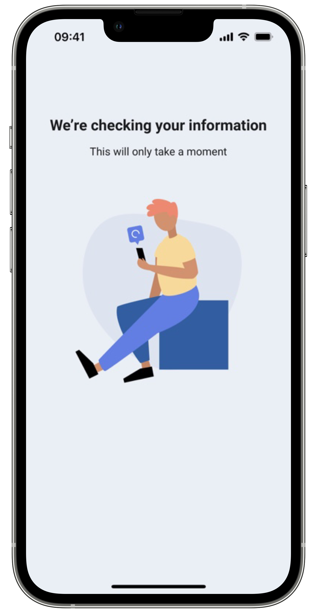

# Biometric Matching

This service allows the submission of two different biometric images, to verify that they represent
the same person. This is necessary whenever there is the need of checking if the current user is the
same person as the physical ID owner in any enrolment process. The candidate image is also submitted
to a service that performs a biometric quality check before the matching process.

## Initiate Match

You can easily provide your client app with a biometric check using our SDK’s biometric matching
functionality, available in the enrolment facade. You need to provide a BiometricMatchParameters
object that includes the reference biometrics image (for example, an official document’s photo),
against which you want to test your candidate image, also passed as a bitmap in this object. You also can include the template option if you want to get the images templates. *None* is the default. Below
is the BiometricMatchParameters structure:

=== "Android"

    ```kotlin
    data class BiometricMatchParameters(
        val candidate: Bitmap?,
        val reference: Bitmap?,
        val templateOption: TemplateOption = TemplateOption.NONE,
        val showErrors: Boolean
    )
    ```
=== "iOS"

    ``` swift
    public struct BiometricMatchParameters {
        public let candidate: Data
        public let reference: Data
        public let includeTemplate: TemplateOptions
    
        public init(candidate: Data,
                reference: Data,
                includeTemplate: TemplateOptions = .none) 
    }
    ```

TemplateOptions is an enumeration and it contains the following cases.

=== "Android"

    ```kotlin
    enum class TemplateOption {
        NONE,
        ALL,
        CANDIDATE,
        REFERENCE
    }
    ```
    
=== "iOS"

    ``` swift
    public enum TemplateOptions: String {
        case none = "None"
        case all = "All"
        case reference = "Reference"
        case candidate = "Candidate"
    }
    ```
You can expect either a MatchError response or a MatchReport response. To start the biometric matching, you must call the following method:

=== "Android"

    This method is now deprecated and will be removed in the future
    ```kotlin
    override fun matchBiometrics(activity: Activity, params: BiometricMatchParameters) {
        enrolment.matchBiometrics(activity, params)
    }
    ```
    The new method contains a new parameter that's responsible to receive the result of this feature
    ```kotlin
    override fun matchBiometrics(activity: Activity, params: BiometricMatchParameters) {
        // More info on the matchResultLauncher in the how to get the result section
        enrolment.matchBiometrics(context, params, matchResultLauncher)
    }
    ```

=== "iOS"

    ``` swift
    func matchBiometrics(parameters: BiometricMatchParameters, viewController: UIViewController, completionHandler: @escaping (Result<MatchReport, BiometricMatchError>) -> Void)
    ```
    
A successful MatchReport response means that matching analysis was successfully computed in the
server-side platform. If the candidate image (for example, a captured photo) scores above the
previously given threshold, the matched value will be true. The field matchDuration gives you
information on the request’s duration and also the templates, if they were requested.

## Handle Result

=== "Android"

    Here's how you can get the result by using the result launcher that's passed as the final parameter:
    ```kotlin
    private val matchBiometricResultLauncher = registerForActivityResult(MatchResultLauncher())
    { result: MatchActivityResult ->
        when {
            result.success -> onMatch(result.matchReportSuccess)
            result.matchReportError?.userCanceled == true -> userCanceled()
            result.matchReportError?.termsAndConditionsAccepted == false ->     termsAndConditionsNotAccepted()
            else -> onMatchFailed()
        }
    }
    ```
    
    Here is how you can get the report when using the deprecated method and handle the onActivityResult:

    ```kotlin
    private val faceMatchResultHandler by lazy { FaceMatchResultHandler() }

    override fun onActivityResult(requestCode: Int, resultCode: Int, data: Intent?) {
        super.onActivityResult(requestCode, resultCode, data)
        when (requestCode) {
            EnrolmentSDKRequestCode.BIOMETRIC_FACE_MATCH_REQUEST_CODE -> {
                val result = faceMatchResultHandler.parseResult(resultCode, data)
                when {
                    result.success -> onMatch(result.matchReportSuccess)
                    result.matchReportError?.userCanceled == true -> userCanceled()
                    result.matchReportError?.termsAndConditionsAccepted == false -> termsAndConditionsNotAccepted()
                    else -> onMatchFailed()
                }
            }
        }
    }
    ```
    
    The MatchReportError has the following structure:

    ```kotlin
    data class MatchReportError(
        val userCanceled: Boolean,
        val termsAndConditionsAccepted: Boolean,
        val featureError: FeatureError?
    )
    ```
    
    The FeatureError has the following structure:

    ```kotlin
    data class FeatureError(
        val errorMessage : String,
        val apiError: ApiError?
    ) : Parcelable
    ```
    
    The ApiError has the following structure:
    
    ```kotlin
    data class ApiError(
        val errors: Map<String, String>?,
        val type: String,
        val title: String,
        val status: Int,
        val detail: String?,
        val instance: String?,
    ) : Parcelable
    ``` 
    
=== "iOS"

    These method’s completion handler passes a result , where the MatchReport contains the Match information and BiometricMatchError contains the possible errors that may occur during the process. Below is an example of usage:

    ```swift
    self.enrolment.matchBiometrics(
        parameters: parameters,
        viewController: vco) { [weak self] result in
        switch result {
        case .success(let matchReport):
            if (matchReport.photosMatched) {
                self?.view?.onMatchSuccess()
            } else {
                self?.view?.onMatchFailed()
            }
        case .failure(let error):
            switch error {
            case .service(let errorInfo):
                self?.view?.onServiceError(message: errorInfo.type)
            case .client, .unexpected, .server, .unreachable:
                self?.view?.onServerError()
            case .serverCertificatePinning:
                self?.view?.onCertificatePinningError()
            case .feature(let featureError):
                self?.view?.onFeatureError(error: featureError)
            @unknown default:
                self?.view?.onServerError()
            }
        }
    }
    ```
    
    The BiometricMatchError has the following structure:
    
    ```swift
    public enum BiometricMatchError: Error {
        /// [BiometricMatchError] that contains an error info about an error that occurs at a Biometric service.
        case service(info: BiometricMatchErrorInfo)
        /// [BiometricMatchError] that occurs when there's an error on the request.
        case client(error: EnrolmentServerError?)
        /// [BiometricMatchError] that occurs when there's an error on the server.
        case server(error: EnrolmentServerError?)
        /// [BiometricMatchError] that occurs when there's an unexpected error.
        case unexpected(message: String)
        /// [BiometricMatchError] that occurs when there's an unreachable error.
        case unreachable(message: String)
        /// [BiometricMatchError] that occurs when there's an error with the pinned certificate.
        case serverCertificatePinning(message: String)
        /// [BiometricMatchError] that occurs when there's an error during a pre/pos feature process.
        case feature(error: FeatureError)
    }
    ```
    
    The BiometricMatchErrorInfo has the following structure:
    
    ```swift
    public struct BiometricMatchErrorInfo {
        public let type: String
        public let matchResult: BiometricMatchResult
    
    }
    ```

    The BiometricMatchErrorInfo has the following structure:
    
    ```swift
    public struct BiometricMatchResult {
        public let threshold: Double
        public let thresholdResult: Double
    }
    ```
    
    The FeatureError has the following structure:
    
    ```swift
    public enum FeatureError: Error {
        /// [FeatureError] that wraps a message error a controlled error occurs at the server.
        case server(error: EnrolmentServerError?)
        /// [FeatureError] that occurs when there's an unexpected error.
        case unexpected(message: String)
        /// [FeatureError] that wraps a `FeatureOperationErrorType` indicating the underlying cause for the error.
        case feature(operationType: FeatureOperationErrorType)
    }
    ```
    The EnrolmentServerError has the following structure:
    ```swift
    public struct EnrolmentServerError {
        public let type: String
        public let statusCode: Int
        public let title: String
        public let detail: String?
        public let instance: String?
        public let traceId: String?
        public let errors: [String: [String]]?
    }
    ```
    The FeatureOperationErrorType has the following structure:
    ```swift
    public enum FeatureOperationErrorType {
        case rgpd
        case permission
        case registerTransaction
    }
    ```
    
In case of success, the MatchReport has the following structure:

=== "Android"

    ```kotlin
    data class MatchReport(
        val matchDuration: String,
        val photosMatched: Boolean,
        val algorithm: String?,
        val referenceTemplate: String?,
        val candidateTemplate: String?,
    )
    ```

=== "iOS"

    ``` swift
    public struct MatchReport: Codable {
        public let matchDuration: String
        public let photosMatched: Bool
        public let algorithm: String?
        public let referenceTemplate: Data?
        public let candidateTemplate: Data?
    }
    ```
    
## Custom Views

The SDK provides default UI solutions for the boarding pass feature flow, as 
shown in the following images:

{: style="height:600px;width:300px;display: block; margin: 0 auto"}

You can also apply your app’s colors and fonts to these layout solutions, to keep your brand’s image consistent.
Check Customization tab to learn more about branding of each view.

=== "Android"
    ```kotlin
    @Parcelize
    class BiometricFaceMatchCustomViews(
        val loadingView: Class<out ICustomBiometricFaceMatch.LoadingView>? = null
    ) : Parcelable
    ```
    You can use your own custom views in the face match functionality. Your view must implement the
    SDK view interfaces. For example, if you want to add a custom loading view, your view class must
    implement the ICustomBiometricFaceMatch.LoadingView interface.

=== "iOS"

    ``` swift
    public class EnrolmentViewRegister {
        ...
        
        // MARK: - Biometric Match
        public func registerBiometricMatchLoadingView(_ viewType: BiometricMatchLoadingViewType)
        ...
    }
    ```

    You can use your own custom views in the face match functionality. Your view must implement the
    SDK view protocols. For example, if you want to add a custom loading view, your view class must
    implement the BiometricMatchLoadingViewType interface.

In the customization tab you will also find examples to create your own custom views.
