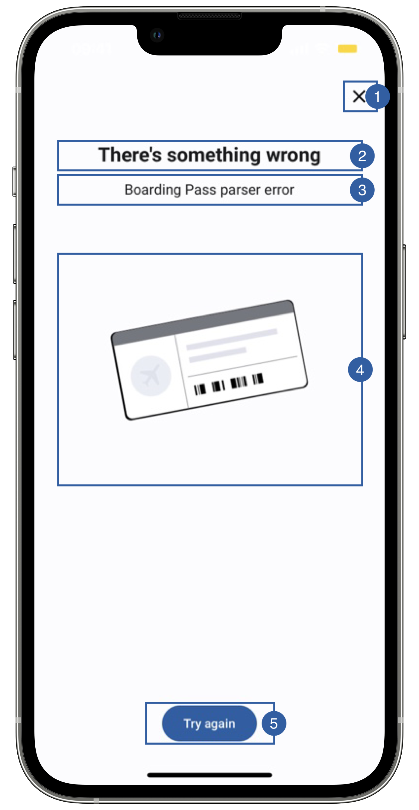

# Error View

In case any error happens in the Boarding pass flow and the flag **showErrors** is active, the Error View will appear in order to give the final user feedback as to may have gone wrong, allowing them to retry or cancel.

{: style="height:600px;width:300px;display: block; margin: 0 auto"}

It contains a close button(1), a title(2), a message(3), an image(4), a retry button (5) and a background that can be customized.

The subtitle text will be the description of the error.

## Branding

You can apply your own branding to our screens by overriding the resources we use.

### Text resources

=== "Android"
    
    You can add your own texts and localization by overriding the following string resources:
    ```xml
    <string name="feature_failure_title_sdk_enrolment">There\'s something wrong</string>

    <!-- Button text (Used in multiple places) -->
    <string name="try_again_sdk_enrolment">Try again</string>
    ```

=== "iOS"

    The best way to override strings is by adding your key through the Theme class for the title
    ``` swift
    Theme.shared.strings.common.failureTitle
    ```
    You can override the following string keys, for the field of messages
    ``` swift
    "boarding_pass_barcorde_empty_error" = "Boarding Pass barcorde is empty";
    "boarding_pass_format_not_supported_error" = "Boarding Pass format not supported";
    "boarding_pass_parser_error" = "Boarding Pass parser error";
    "boarding_pass_config_error" = "Error reading Boarding Pass";
    "boarding_pass_not_valid_error" = "Boarding Pass not valid";
    "boarding_pass_cancelled_error" = "Boarding Pass cancelled Error";
    ```

### Colors
=== "Android"

    You can change the text colors by overriding the following color resource (It affects all texts):
    ```xml
    <color name="colorOverlayInvalidTxtSdkEnrolment">#1A1C1E</color>
    ```

    You can change the background color by overriding the following color resource:
    ```xml
    <color name="colorOverlayInvalidBgSdkEnrolment">#F1F0F4</color>
    ```

    You can change the buttons text and background color by overriding the following color resources:
    ```xml
    <color name="colorButtonBlueBackgroundTintSdkEnrolment">#1F5FA6</color>
    <color name="colorButtonBlueTextSdkEnrolment">@android:color/white</color>
    ```

=== "iOS"

    You can change the text colors by overriding the following color in Theme class 
    ``` swift
    Theme.shared.colors.faceCapture.titleDark// title(2) and message(3) (It affects other screens)
    ```
    You can change the background color by overriding the following color in Theme class:
    ``` swift
    Theme.shared.colors.faceCapture.background (It affects other screens)
    ```
    You can change the color of the close button(1) (It affects other screens)
    ``` swift
    Theme.shared.colors.common.black
    ```
    You can change the color of the button (this affects all primary style buttons)
    ``` swift
    Theme.shared.colors.button.primaryBackground
    Theme.shared.colors.button.primaryTitle
    ```
    
### Styles
=== "Android"

    You can extend the styles we use and override any properties (textColor, textSize, fontFamily, etc...) you want.
    ```xml
    <style name="Theme.Sdk.Enrolment.TextView.Dark.Title.Centered">
    <style name="Theme.Sdk.Enrolment.TextView.Dark.Subtitle.Centered">
    <style name="Theme.Sdk.Enrolment.Button.Blue">
    ```
    Note: It will affect every component that uses the same style.

=== "iOS"

    You can change the font through the theme class (this will affect all text in the app):
    ``` swift
    Theme.shared.fonts.bold
    Theme.shared.fonts.regular
    ```

### Image

=== "Android"

    You can change the image by adding a drawable with this name:
    ```xml
    ic_boardingpass_gray_large_sdk_enrolment.xml
    ```
    The image we are using is 240x240dp.

    You can change the cancel button icon by adding a drawable with this name:
    ```xml
    ic_close.xml
    ```
    The image we are using is 24x24dp.

=== "iOS"

    You can change the image by adding a asset file and overriding the following image name in Theme class
    ``` swift
    Theme.shared.images.buttons.closeButton // It affects all close buttons
    Theme.shared.images.boardingPass.boardingPassError
    ```