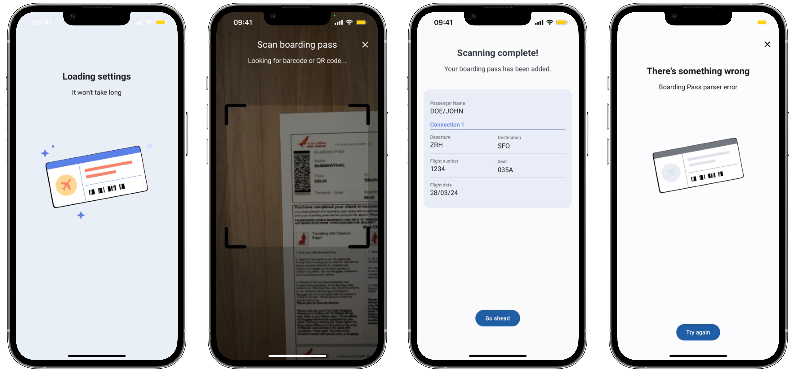

# Boarding Pass

The boarding pass scan is used to extract encoded information in boarding passes that comply with
the BCBP (Bar-Coded Boarding Pass) standard. The SDK is prepared to return the data from boarding
passes in the following supported formats: 

- Barcode PDF417;
- Aztec;
- QR code;
- DataMatrix.

Additionally, you can submit the boarding pass data to a back-end server platform when creating a
subject.

## Initiate Scan

Another functionality available in the enrolment facade is the bar-coded boarding pass scanning.
This is helpful whenever your app needs to extract all encoded information in a printed or digital
boarding pass if it was generated according to the international BCBP standard. 

The mobile device will be able to scan boarding passes using the back camera. The SDK supports all the available
formats in the IATA Bar-Coded Boarding Pass standard: PDF417, Aztec, QR code and DataMatrix. To
start the barcode scanner, you must call the following method:

=== "Android"

    ```kotlin
    /**
    * Scans a Bar Coded Boarding Pass (BCBP).
    *
    * @param context [Context] Activity holder
    * @param params [BoardingPassScanParameters] required to start the boarding pass scan feature.
    * @param resultLauncher [ActivityResultLauncher<Intent>] fragment or activity that will handle the results.
    */
    fun scanBoardingPass(
        context: Context,
        params: BoardingPassScanParameters,
        resultLauncher: ActivityResultLauncher<Intent>
    )
    ```

=== "iOS"

    ``` swift
    func scanBoardingPass(parameters: ScanBoardingPassParameters, viewController: UIViewController, completionHandler: @escaping (Result<BoardingPassFull, BoardingPassError>) -> Void)
    ```   

The BoardingPassScanParameters has the following structure:
=== "Android"
    ```kotlin
    @Parcelize
    data class BoardingPassScanParameters(
        val showPreview: Boolean,
        val showErrors: Boolean,
        val validate: Boolean
    ) : Parcelable
    ```

=== "iOS"

    ``` swift
    public struct ScanBoardingPassParameters {
        public let showPreview: Bool
        public let showErrors: Bool
        public let validateBoardingPass: Bool
    
        public init(showPreview: Bool,
                    showErrors: Bool,
                    validateBoardingPass: Bool)
    }
    ```  

The **showPreview** flag should be set to true if you want the SDK to present the details of the
scanned boarding pass, the **showErrors** flag should be set to true if you want the SDK to present the default error screens to show the errors that occur during the features and the **validate** flag should be set to true if you want the SDK to
validate the boarding pass data. 

If you want to use your own boarding pass scanner, you can also provide the raw result of the scan and pass it to the facade’s parser method. It will return the
BoardingPass object. The raw result must be passed to the BoardingPassData, which has to be included
in the BoardingPassParserParameters.

From version 7 onwards there is a new way to parse a boarding pass, by giving us an image URI and if the boarding pass is detected in it, it will be parsed and you will receive a BoardingPass object without requiring to provide us the format.

=== "Android"

    ```kotlin
    /**
     * Parses a Bar Coded Boarding Pass (BCBP).
     *
     * @param context
     * @param params [BoardingPassStringParserParameters] required to start the boarding pass parser feature.
     * @param resultLauncher [ActivityResultLauncher<Intent>] fragment or activity that will handle the results.
     */
    fun parseBoardingPass(
        context: Context,
        params: BoardingPassStringParserParameters,
        resultLauncher: ActivityResultLauncher<Intent>
    )

    /**
     * Parses an image of a Bar Coded Boarding Pass (BCBP).
     *
     * @param context
     * @param params [BoardingPassImageParserParameters] required to start the boarding pass image parser feature.
     * @param resultLauncher [ActivityResultLauncher<Intent>] fragment or activity that will handle the results.
     */
    fun parseBoardingPass(
        context: Context,
        params: BoardingPassImageParserParameters,
        resultLauncher: ActivityResultLauncher<Intent>
    )
    ```

=== "iOS"

    ``` swift
    func parseBoardingPass(parameters: ParseBoardingPassParameters, viewController: UIViewController, completionHandler: @escaping (Result<BoardingPass, BoardingPassParserError>) -> Void)
    ```

The BoardingPassParserParameters object has the following structure:
=== "Android"

    ```kotlin
    /**
    * Parameters for each [BoardingPass] parser operation.
    *
    * @param showPreview if true, it will show a preview of [BoardingPass].
    * @param showErrors if true, it will show a error screen that contains information regarding any error that happened during this feature.
    * @param validate if true, it will perform validation of the [BoardingPass] fields.
    */
    @Parcelize
    open class BoardingPassParserParameters(
        open val showPreview: Boolean,
        open val showErrors: Boolean,
        open val validate: Boolean
    ) : Parcelable

    /**
    * Parameters for each [BoardingPass] parser operation.
    *
    * @param boardingPassData [BoardingPassData] that will that has the barcode raw data and format to be parsed to a [BoardingPass].
    */
    @Parcelize
    data class BoardingPassStringParserParameters(
        val boardingPassData: BoardingPassData,
        override val showPreview: Boolean,
        override val showErrors: Boolean,
        override val validate: Boolean
    ) : BoardingPassParserParameters(
        showPreview,
        showErrors,
        validate
    )
    
    /**
    * Parameters for each [BoardingPass] parser operation.
    *
    * @param uri URI to an image file of a [BoardingPass] that will be analyzed and parsed.
    */
    @Parcelize
    data class BoardingPassImageParserParameters(
        val uri: Uri,
        override val showPreview: Boolean,
        override val showErrors: Boolean,
        override val validate: Boolean
    ) : BoardingPassParserParameters(
        showPreview,
        showErrors,
        validate
    )
    ```

=== "iOS"

    ``` swift
    public struct ParseBoardingPassParameters {
        public let showPreview: Bool
        public let showErrors: Bool
        public let validateBoardingPass: Bool
        public let boardingPassData: BoardingPassData
        public let boardingPassImage: UIImage?
    
        public init(showPreview: Bool,
                    showErrors: Bool,
                    validateBoardingPass: Bool,
                    boardingPassData: BoardingPassData,
                    boardingPassImage: UIImage?)
    }
    ```

The BoardingPassData is a model where you will have to provide the raw barcode scan result and the
barcode format. Below is the model structure:
=== "Android"

    ```kotlin
    @Parcelize
    data class BoardingPassData(
        val rawBarcodeData: String,
        val barcodeFormat: BarcodeFormat
    ) : Parcelable
    ```

=== "iOS"

    ``` swift
    public struct BoardingPassData {
        public let rawBarcodeData: String
        public let barcodeFormat: BarcodeFormat
    
        public init(rawBarcodeData: String, barcodeFormat: BarcodeFormat)
    }

    ```
BarcodeFormat is an enumeration and it contains the following cases.
=== "Android"

    ```kotlin
    enum class BarcodeFormat(val value: String) {
        AZTEC("AZTECCODE"),
        PDF417("PDF417"),
        QR_CODE("QR_CODE"),
        DATA_MATRIX("DataMatrix")
    }
    ```

=== "iOS"

    ``` swift
    public enum BarcodeFormat: String {
        case aztec
        case pdf417
        case qrCode
        case dataMatrix
    }

    ```
## Handle Result

=== "Android"

    Here's how you can get the result by using the result launcher that's passed as the final parameter:

    ```kotlin
    private val boardingPassResultLauncher = registerForActivityResult(BoardingPassResultLauncher())
    { result: BoardingPassActivityResult ->
        when {
            result.success -> presenter.storeBoardingPass(result.boardingPass)
            result.boardingPassError?.userCanceled == true -> onUserCanceled()
            result.boardingPassError?.termsAndConditionsAccepted == true -> onTermsAndConditionsRejecetd()
            else -> onBoardingPassScanError()
        }
    }
    ```

    You will receive a model of the type BoardingPassActivityResult that will contain the success data (in this case a BoardingPass) or the error data.

    ```kotlin
    data class BoardingPassActivityResult(
        val boardingPass: BoardingPass?,
        val boardingPassError: BoardingPassError?
    ) {
        val success get() = boardingPass != null
    }
    ```

    The BoardingPassError has the following structure:
    
    ```kotlin
    data class BoardingPassError(
        val userCanceled: Boolean,
        val termsAndConditionsAccepted: Boolean,
        val featureError: FeatureError?
    )
    ```

=== "iOS"

    These method’s completion handler passes a result <BoardingPass, BoardingPassScanError>, where the BoardingPass contains the boarding pass data and BoardingPassScanError contains the possible errors that may occur during the process.
    Below is an example of usage:

    ```swift
    let parameters = ScanBoardingPassParameters(
                showPreview: true, showErrors: true, validateBoardingPass: preferences.useIataStandards())

     self.enrolment.scanBoardingPass(parameters: parameters, viewController: vc) { [weak self] result in
            switch result {
            case .success(let boardingPass):
                // Handle Success
            case .failure(let error):
                if error.userCanceled {
                    print("onUserCancel")
                } else {
                    print(error.featureError.publicMessage)
                }
            }
        }
    ```
    The BoardingPassScanError and BoardingPassError has the following structure:
    
    ```swift
    public class BoardingPassError: Error {
        public var userCanceled: Bool
        public var termsAndConditionsAccepted: Bool
        public var featureError: FeatureError
    }
    ```
    
In case of success, the BoardingPass has the following structure:
=== "Android"

    ```kotlin
    @Parcelize
    data class BoardingPass(
        val rawBoardingPass: String,
        val barcodeType: String,
        val expiryDate: Date,
        val formatCode: String,
        val numberOfLegs: Int,
        val passengerName: String,
        val electronicTicketIndicator: String,
        val beginningOfVersionNumber: String? = null,
        val versionNumber: Int? = null,
        val passengerDescription: Int? = null,
        val checkInSource: String? = null,
        val boardingPassSource: String? = null,
        val boardingPassDate: String? = null,
        val documentType: String? = null,
        val boardingPassIssuerDesignator: String? = null,
        val baggageTagNumber: String? = null,
        val firstNonConsecutiveBaggageTagNumber: String? = null,
        val secondNonConsecutiveBaggageTagNumber: String? = null,
        val securityDataBeginning: String? = null,
        val legs: List<Leg>
    ) : Parcelable
    ```

=== "iOS"

    ``` swift
    public struct BoardingPass: Codable {
        public let formatCode: String
        public let barcodeType: String
        public let numberOfLegsEncoded: Int
        public let passengerName: String
        public let electronicTicketIndicator: String?
        public let rawBoardingPass: String
        public let expiryDate: Date
        public let beginningOfVersionNumber: String?
        public let versionNumber: Int?
        public let passengerDescription: String?
        public let checkInSource: String?
        public let boardingPassSource: String?
        public let boardingPassDateString: String?
        public let documentType: String?
        public let boardingPassIssuerDesignator: String?
        public let baggageTagNumber: String?
        public let firstNonConsecutiveBaggageTagNumber: String?
        public let secondNonConsecutiveBaggageTagNumber: String?
        public let securityDataBeginning: String?
        public let legs: [Leg]
    }
    ```
The Leg has the following structure:
=== "Android"

    ```kotlin
    @Parcelize
    data class Leg(
        val legOrder: Int,
        val operatingCarrierPnrCode: String,
        val originAirportCode: String,
        val destinationAirportCode: String,
        val operatingCarrierDesignator: String,
        val flightNumber: String,
        val flightDate: String,
        val compartmentCode: String,
        val seatNumber: String,
        val checkInSequenceNumber: String,
        val passengerStatus: String,
        val airlineNumericCode: String? = null,
        val serialNumber: String? = null,
        val selecteeIndicator: Int? = null,
        val internationalDocumentVerification: Int? = null,
        val marketingCarrierDesignator: String? = null,
        val frequentFlyerAirlineDesignator: String? = null,
        val frequentFlyerNumber: String? = null,
        val idAdIndicator: String? = null,
        val freeBaggageAllowance: String? = null,
        val fastTrack: String? = null
    ) : Parcelable
    ```

=== "iOS"

    ``` swift
    public struct Leg: Codable {
        public let flightNumber: String?
        public let frequentFlyerNumber: String?
        public let documentSerialNumber: String?
        public let airlineNumericCode: String?
        public let passengerStatus: String?
        public let sequenceNumber: String?
        public let seatNumber: String?
        public let compartmentCode: String?
        public let flightDate: String?
        public let legOrder: Int?
        public let carrierDesignator: String?
        public let destinationAirport: String?
        public let originAirport: String?
        public let carrierPnrCode: String?
        public let frequentFlyerAirlineDesignator: String?
        public let selecteeIndicator: Int?
        public let internationalDocumentVerification: Int?
        public let marketingCarrierDesignator: String?
        public let idAdIndicator: String?
        public let freeBaggageAllowance: String?
        public let fastTrack: String?
    }
    ```

## Custom Views
The SDK provides default UI solutions for the boarding pass feature flow, as 
shown in the following images:

{: style="display: block; margin: 0 auto"}

The use of the preview layout depends on the **showPreview** flag in the BoardingPassScanParameters. 

You can also apply your app’s colors and fonts to these layout solutions, to keep your brand’s image consistent.
Check Customization tab to learn more about branding of each view.

=== "Android"

    ```kotlin
    @Parcelize
    class BoardingPassCustomViews(
        val loadingView: Class<out ICustomBoardingPass.LoadingView>? = null
    ) : Parcelable
    ```
    
    Our SDK also allows you to pass your own custom views. The only requirement is that your view must implement the
    SDK view interfaces. For example, if you want to add a custom loading view, your view class must
    implement the ICustomBoardingPass.LoadingView interface.
    
=== "iOS"

    ``` swift
    public class EnrolmentViewRegister {
        ...
        public func registerBoardingPassScannerLoadingView(_ viewType: BoardingPassLoadingViewType)
        
        ...
    }
    ```

    Our SDK also allows you to pass your own custom views. The only requirement is that your view must implement the
    SDK view protocols. For example, if you want to add a custom loading view, your view class must
    implement the BoardingPassLoadingViewType.

In the customization tab you will also find examples to create your own custom views.
