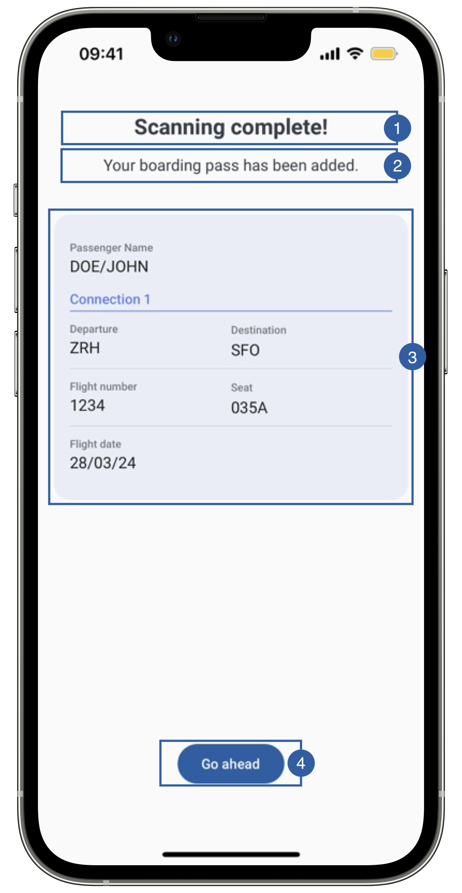
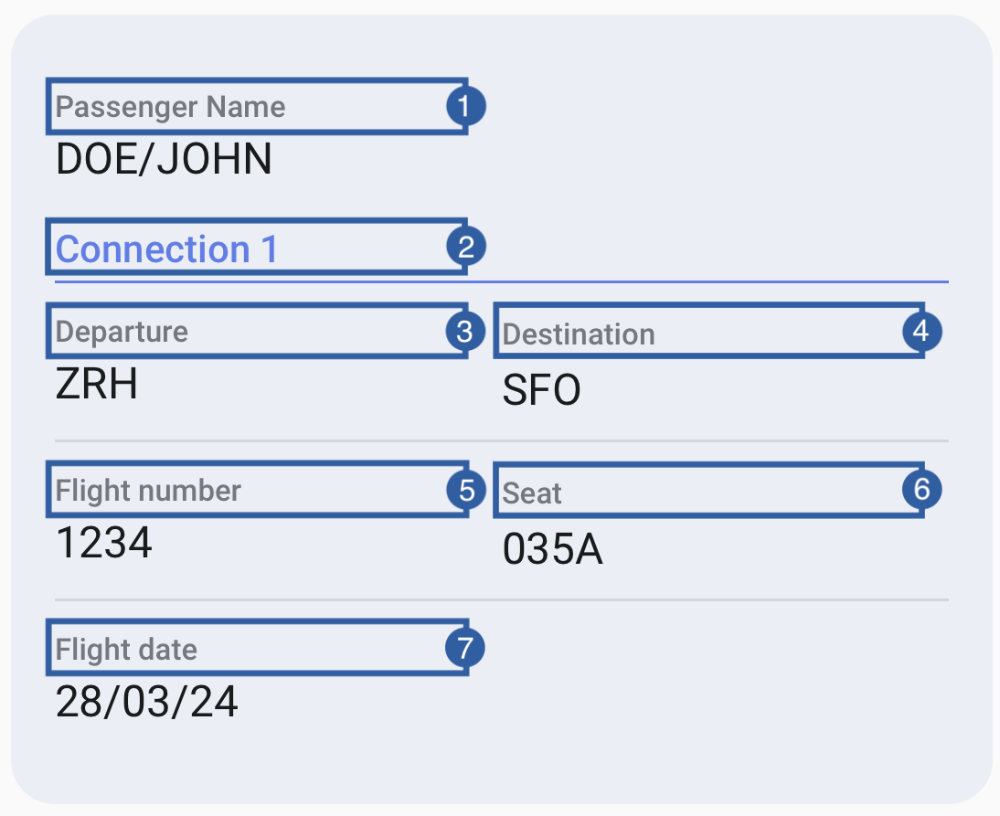

# Preview View

If the flag **showPreview** is set to true, then, when the boarding pass is parsed successfully, the preview view is going to show the details of the boarding pass.

{: style="height:600px;width:300px"}
{: style="height:300px;width:300px"}

It contains a title(1), a message(2), a subview(3) containing all boarding pass information, a button(4) to finish the flow and a background that can be customized.

The subview is a group that displays all the information collected from the boarding pass. 
It contains multiple labels, and beneath each label, it will be displayed the corresponding information.
    
1. Passenger name
2. Connection Section
3. Departure
4. Destination
5. Flight number
6. Seat
7. Flight Date

## Branding

You can apply your own branding to our screens by overriding the resources we use.

### Text resources

=== "Android"

    You can add your own texts and localization by overriding the following string resources:
    ```xml
    <string name="document_reader_mrzScan_success_title_sdk_enrolment">Scanning complete!</string>
    <string name="boarding_pass_preview_success_subtitle_sdk_enrolment">Your boarding pass has been added.</string>
    <string name="bt_continue_sdk_enrolment">Go ahead</string>
    <!-- Subview labels -->
    <string name="boarding_pass_preview_field_name_sdk_enrolment">Passenger</string>
    <string name="boarding_pass_preview_field_origin_sdk_enrolment">Departure</string>
    <string name="boarding_pass_preview_field_destination_sdk_enrolment">Destination</string>
    <string name="boarding_pass_preview_field_flight_number_sdk_enrolment">Flight number</string>
    <string name="boarding_pass_preview_field_seat_sdk_enrolment">Seat</string>
    <string name="boarding_pass_preview_field_flight_date_sdk_enrolment">Flight date</string>
    <string name="boarding_pass_preview_leg_header_format_sdk_enrolment">Connection %d</string>
    ```

=== "iOS"

    The best way to override strings is by adding your key through the Theme class
    ``` swift
    Theme.shared.strings.boardingPassPreview.title
    Theme.shared.strings.boardingPassPreview.subtitle
    Theme.shared.strings.boardingPassPreview.passengerName
    Theme.shared.strings.boardingPassPreview.legHeaderFormat
    Theme.shared.strings.boardingPassPreview.origin
    Theme.shared.strings.boardingPassPreview.destination
    Theme.shared.strings.boardingPassPreview.flightNumber
    Theme.shared.strings.boardingPassPreview.seat
    Theme.shared.strings.boardingPassPreview.flightDate
    Theme.shared.strings.buttons.continue
    ```

### Colors
=== "Android"

    You can change the text colors by overriding the following color resource (It affects all texts):
    ```xml
    <color name="colorFaceCaptureTxtDarkSdkEnrolment">#1A1C1E</color>
    ```

    You can change the background color of the view or the details card by overriding the following color resources:
    ```xml
    <color name="colorBoardingPassBgSdkEnrolment">#FDFCFF</color> <!-- Outside view -->
    <color name="colorDocumentPreviewBg">#EAEEF6</color> <!-- Card -->
    ```

    You can change the buttons text and background color by overriding the following color resources:
    ```xml
    <color name="colorButtonBlueBackgroundTintSdkEnrolment">#1F5FA6</color>
    <color name="colorButtonBlueTextSdkEnrolment">@android:color/white</color>
    ```

=== "iOS"

    You can change the text colors by overriding the following color in Theme class 
    ``` swift
    Theme.shared.colors.documentData.title // title(1) and message(2)
    Theme.shared.colors.datafield.title
    Theme.shared.colors.datafield.value
    Theme.shared.colors.boardingPassPreview.legHeader // Connection Section (for both text and separate)
    ```
    You can change the background color by overriding the following color in Theme class:
    ``` swift
    Theme.shared.colors.boardingPassPreview.background
    Theme.shared.colors.common.backgroundCards // card color (It affects other screens)
    ```
    You can change the color of the button (this affects all primary style buttons)
    ``` swift
    Theme.shared.colors.button.primaryBackground
    Theme.shared.colors.button.primaryTitle
    ```
### Styles
=== "Android"

    You can extend the styles we use and override any properties (textColor, textSize, fontFamily, etc...) you want.
    ```xml
    <style name="Theme.Sdk.Enrolment.TextView.Dark.Title.Centered">
    <style name="Theme.Sdk.Enrolment.TextView.Dark.Subtitle.Centered">
    <style name="Theme.Sdk.Enrolment.Button.Blue">
    ```
    Note: It will affect every component that uses the same style.

=== "iOS"

    You can change the font through the theme class (this will affect all text in the app):
    ``` swift
    Theme.shared.fonts.bold
    Theme.shared.fonts.regular
    Theme.shared.fonts.medium
    ```