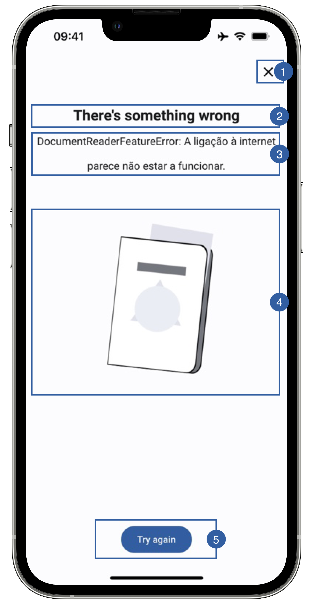

# Error View

In case any error happens in the Document Error flow and the flag **showErrros** is active, the Error View will appear in order to give the final user feedback as to may have gone wrong, allowing them to retry or cancel.

{: style="height:600px;width:300px;display: block; margin: 0 auto"}

It contains a close button(1), a title(2), a message(3), an image(4), a retry button (5) and a background that can be customized.

The subtitle text will be the description of the error.

## Branding

You can apply your own branding to our screens by overriding the resources we use.

### Text resources

=== "Android"

    You can add your own texts and localization by overriding the following string resources:
    ```xml
    <string name="feature_failure_title_sdk_enrolment">There\'s something wrong</string>
    <string name="try_again_sdk_enrolment">Try again</string>

    <!-- Document Reader Errors -->
    <string name="error_mrz_sdk_enrolment">Error reading document.</string>
    <string name="error_mrz_no_result_sdk_enrolment">Failed to find document reader results while scanning the document.</string>
    <string name="error_regula_error_sdk_enrolment">Regula returned error reading document.</string>
    <string name="error_mrz_not_ready_error_sdk_enrolment">Failed to initialize document reader scanner.</string>
    <string name="error_rfid_not_ready_error_sdk_enrolment">Document Reader rfid not ready to read document.</string>
    <string name="error_regula_init_error_sdk_enrolment">Failed to initiate regula sdk.</string>
    <string name="error_resources_error_sdk_enrolment">There was an error requesting the resources endpoint.</string>
    <string name="error_no_csca_cert_error_sdk_enrolment">No CSCA certificates configured for this APIKey.</string>
    <string name="error_csca_cert_not_found_error_sdk_enrolment">We couldn\'t download the CSCA certificates. They might not exist in the path returned by the backend.</string>
    <string name="error_csca_cert_invalid_error_sdk_enrolment">We couldn\'t find the CSCA certificates.</string>
    <string name="error_license_not_found_error_sdk_enrolment">Got a license file path, but this file does not exist.</string>
    <string name="error_failed_register_transaction_error_sdk_enrolment">Document Reader Transaction service failed.</string>
    <string name="error_permission_not_granted_error_sdk_enrolment">Permission not granted for Document Read feature.</string>
    <string name="error_config_not_found_error_sdk_enrolment">Document reader configuration not found.</string>
    <string name="error_terms_and_conditions_not_accepted_error_sdk_enrolment">Document reader terms and conditions not accepted by user.</string>
    <string name="error_mrz_timeout_error_sdk_enrolment">Document scan operation has timed out.</string>
    <string name="error_regula_database_download_error_sdk_enrolment">Error downloading regula database.</string>
    <string name="error_result_from_rfid_null_error_sdk_enrolment">Document reader from rfid is null.</string>
    <string name="error_result_from_preview_null_error_sdk_enrolment">Document reader result from preview is null.</string>
    ```

=== "iOS"

    The best way to override strings is by adding your key through the Theme class for the title
    ``` swift
    Theme.shared.strings.common.failureTitle
    ```
    
    The message field cannot be overridden at this time as it displays dynamic messages
    
    You can override the following string keys, for the button title (It affects all error views)
    ``` swift
    Theme.shared.strings.buttons.tryAgain
    ```
        

### Colors
=== "Android"

    You can change the text colors by overriding the following color resource (It affects all texts):
    ```xml
    <color name="colorOverlayInvalidTxtSdkEnrolment">#1A1C1E</color>
    ```

    You can change the background color by overriding the following color resource:
    ```xml
    <color name="colorOverlayInvalidBgSdkEnrolment">#F1F0F4</color>
    ```

    You can change the buttons text and background color by overriding the following color resources:
    ```xml
    <color name="colorButtonBlueBackgroundTintSdkEnrolment">#1F5FA6</color>
    <color name="colorButtonBlueTextSdkEnrolment">@android:color/white</color>
    ```

=== "iOS"

    You can change the text colors by overriding the following color in Theme class 
    ``` swift
    Theme.shared.colors.faceCapture.titleDark// title(2) and message(3) (It affects other screens)
    ```
    You can change the background color by overriding the following color in Theme class:
    ``` swift
    Theme.shared.colors.faceCapture.background (It affects other screens)
    ```
    You can change the color of the close button(1) (It affects other screens)
    ``` swift
    Theme.shared.colors.common.black
    ```
    You can change the color of the button (this affects all primary style buttons)
    ``` swift
    Theme.shared.colors.button.primaryBackground
    Theme.shared.colors.button.primaryTitle
    ```
    
### Styles
=== "Android"

    You can extend the styles we use and override any properties (textColor, textSize, fontFamily, etc...) you want.
    ```xml
    <style name="Theme.Sdk.Enrolment.TextView.Dark.Title.Centered">
    <style name="Theme.Sdk.Enrolment.TextView.Dark.Subtitle.Centered">
    <style name="Theme.Sdk.Enrolment.Button.Blue">
    ```
    Note: It will affect every component that uses the same style.

=== "iOS"

    You can change the font through the theme class (this will affect all text in the app):
    ``` swift
    Theme.shared.fonts.bold
    Theme.shared.fonts.regular
    ```

### Image

=== "Android"

    You can change the image by adding a drawable with this name:
    ```xml
    ic_passport_gray.xml
    ```
    The image we are using is 120x120dp.

    You can change the cancel button icon by adding a drawable with this name:
    ```xml
    ic_close.xml
    ```
    The image we are using is 24x24dp.

=== "iOS"

    You can change the image by adding a asset file and overriding the following image name in Theme class
    ``` swift
    Theme.shared.images.buttons.closeButton // It affects all close buttons
    Theme.shared.images.documentReader.passportError
    ```