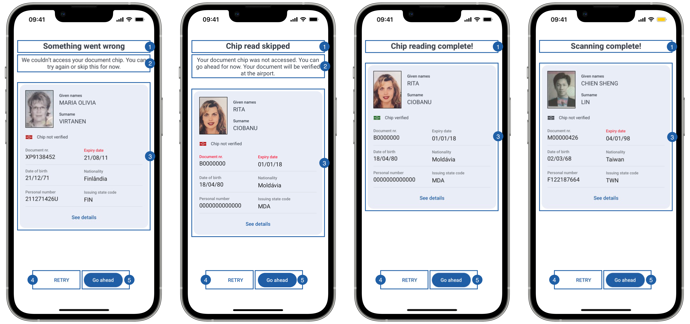

# Preview View

If the flag **showPreview** is set to true, then, when the Document is read successfully, the preview view is going to show the details of the document.

{: style="display: block; margin: 0 auto"}

This screen can have 4 states, in all of them the OCR reading was successful but the chip can have several states from left to right:

- Chip reading error
- User skipped chip reading
- Successful chip reading (does not have the message label)
- It is not an e-Document (does not have the message label)

It contains a title(1), a message(2), a subview(3) containing all document information, a retry button(4) to read the document again, a continue button(5) to finish the flow and a background that can be customized.

{: style="height:734px;width:300px;display: block; margin: 0 auto"}

The subview is a group that displays all the information collected from the document. 
It contains multiple labels, and beneath each label, it will be displayed the corresponding information.
    
1. Given names
2. Surname
3. Chip status
4. Doc. class code
5. Document nr.
6. Date of birth
7. Expiry date
8. Personal number
9. Gender
10. Issuing state code
11. Issuing state name
12. Nationality code
13. Nationality
14. Given names
15. Surname
16. Optional data
17. MRZ
18. See/Hide details button

## Branding

You can apply your own branding to our screens by overriding the resources we use.

### Text resources

=== "Android"

    You can add your own texts and localization by overriding the following string resources:
    ```xml
    <!-- Document Preview Titles --> 
    <string name="document_reader_mrzScan_success_title_sdk_enrolment">Scanning complete!</string>
    <string name="document_reader_rfid_success_title_sdk_enrolment">Chip read complete!</string>
    <string name="document_reader_rfid_skipped_title_sdk_enrolment">Chip read skipped</string>
    <string name="document_reader_mrzScan_failure_title_sdk_enrolment">Something went wrong</string>
    <!-- Document Data --> 
    <string name="document_data_field_document_number_sdk_enrolment">Document nr:</string>
    <string name="document_data_field_expiry_date_sdk_enrolment">Expiry date:</string>
    <string name="document_data_field_date_of_birth_sdk_enrolment">Date of birth:</string>
    <string name="document_data_field_nationality_sdk_enrolment">Nationality:</string>
    <string name="document_data_field_personal_number_sdk_enrolment">Personal number:</string>
    <string name="document_data_field_issuing_state_name_sdk_enrolment">Issuing state name:</string>
    <string name="document_data_field_doc_class_code_sdk_enrolment">Doc. class code:</string>
    <string name="document_data_field_issuing_state_code_sdk_enrolment">Issuing state code:</string>
    <string name="document_data_field_gender_sdk_enrolment">Gender:</string>
    <string name="document_data_field_surname_sdk_enrolment">Surname:</string>
    <string name="document_data_field_given_names_sdk_enrolment">Given names:</string>
    <string name="document_data_field_nationality_code_sdk_enrolment">Nationality code:</string>
    <string name="document_data_field_optional_data_sdk_enrolment">Optional data:</string>
    <string name="document_data_field_mrz_sdk_enrolment">MRZ:</string>
    <string name="document_data_field_sex_and_age_format_sdk_enrolment">%1$s, Age: %2$s</string>
    <!-- Buttons -->
    <string name="bt_hide_details_sdk_enrolment">Hide details</string>
    <string name="bt_see_details_sdk_enrolment">See details</string>
    <!-- RFID Status -->
    <string name="rfid_read_chip_verified_sdk_enrolment">Chip verified</string>
    <string name="rfid_read_chip_not_verified_sdk_enrolment">Chip not verified</string>
    <string name="rfid_read_chip_not_available_sdk_enrolment">It seems that this document does not have a chip. Please, check your information below:</string>
    ```

=== "iOS"

    The best way to override strings is by adding your key through the Theme class
    ``` swift
    //Document Preview Titles - It is not an e-Document (does not have the message label)
    Theme.shared.strings.documentReader.titleNFCNotSupported
    
    //Document Preview Titles - User skipped chip reading
    Theme.shared.strings.documentReader.titleChipSkipped
    Theme.shared.strings.documentReader.subtitleChipSkipped
    
    //Document Preview Titles - Successful chip reading (does not have the message label)
    Theme.shared.strings.documentReader.titleChipSuccess
    
    //Document Preview Titles - Chip reading error
    Theme.shared.strings.documentReader.titleChipError
    Theme.shared.strings.documentReader.subtitleChipError
    
    // Document Data
    Theme.shared.strings.documentData.surname
    Theme.shared.strings.documentData.givenNames
    Theme.shared.strings.documentData.docClassCode
    Theme.shared.strings.documentData.documentId
    Theme.shared.strings.documentData.birthDate
    Theme.shared.strings.documentData.expiryDate
    Theme.shared.strings.documentData.personalNumber
    Theme.shared.strings.documentData.gender
    Theme.shared.strings.documentData.issuingStateCode
    Theme.shared.strings.documentData.issuingStateName
    Theme.shared.strings.documentData.nationalityCode
    Theme.shared.strings.documentData.nationality
    Theme.shared.strings.documentData.optionalData
    Theme.shared.strings.documentData.mrz
    
    //RFID Status
    Theme.shared.strings.documentDatachipVerified
    Theme.shared.strings.documentDatachipNotVerified 
    Theme.shared.strings.documentDatachipNotAvailable
    
    //Buttons
    Theme.shared.strings.buttons.showDetails
    Theme.shared.strings.buttons.retry
    Theme.shared.strings.buttons.continue
    ```
    
### Colors

=== "Android"

    You can change the text colors by overriding the following color resource (It affects all texts):
    ```xml
    <!-- Titles text color-->
    <color name="colorFaceCaptureTxtDarkSdkEnrolment">#1A1C1E</color>
    <!-- Form colors-->
    <color name="colorDocumentDataFormHeaderTxtSdkEnrolment">#5A7FEB</color>
    <color name="colorDocumentDataFormHeaderSeparatorSdkEnrolment">#5A7FEB</color>
    <color name="colorDocumentDataFormFieldHeaderTxtSdkEnrolment">#8B8D95</color>
    <color name="colorDocumentDataFormFieldTxtSdkEnrolment">#5E646C</color>
    <color name="colorDocumentDataFormFieldErrorTxtSdkEnrolment">#D40000</color>
    <color name="colorDocumentDataFormSeparatorSdkEnrolment">#979797</color>
    ```

    You can change the background color of the view or the details card by overriding the following color resources:
    ```xml
    <!-- Screen Background color-->
    <color name="colorDocumentDataBgSdkEnrolment">#FDFCFF</color>
    <!-- Form Background color-->
    <color name="colorDocumentPreviewBg">#EAEEF6</color>
    ```

    You can change the buttons text and background color by overriding the following color resources:
    ```xml
    <!-- Continue Button-->
    <color name="colorButtonBlueBackgroundTintSdkEnrolment">#1F5FA6</color>
    <color name="colorButtonBlueTextSdkEnrolment">@android:color/white</color>
    <!-- Retry Button-->
    <color name="colorButtonTransparentTextSdkEnrolment">#1F5FA6</color>
    <color name="colorButtonTransparentBackgroundTintSdkEnrolment">@android:color/transparent</color>
    ```

=== "iOS"

    You can change the text colors by overriding the following color in Theme class 
    ``` swift
    Theme.shared.colors.documentData.title // title(1) and message(2)
    Theme.shared.colors.datafield.title //to all 
    Theme.shared.colors.datafield.value
    ```
    You can change the background color by overriding the following color in Theme class:
    ``` swift
    Theme.shared.colors.documentData.background
    Theme.shared.colors.common.backgroundCards // card color (It affects other screens)
    ```
    
    You can change the color of the retry button(4) (this affects all secondary style buttons)
    ``` swift
    Theme.shared.colors.button.secondaryBackground
    Theme.shared.colors.button.secondaryTitle
    ```
    
    You can change the color of the continue button(5) (this affects all primary style buttons)
    ``` swift
    Theme.shared.colors.button.primaryBackground
    Theme.shared.colors.button.primaryTitle
    ```

### Styles

=== "Android"

    You can extend the styles we use and override any properties (textColor, textSize, fontFamily, etc...) you want.
    ```xml
    <style name="Theme.Sdk.Enrolment.TextView.Dark.Title.Centered">
    <style name="Theme.Sdk.Enrolment.TextView.Dark.Subtitle.Centered">
    <style name="Theme.Sdk.Enrolment.Button.Blue">
    <style name="Theme.Sdk.Enrolment.Button.White">

    <!-- Form styles-->
    <style name="Theme.Sdk.Enrolment.Form.Field.Header">
    <style name="Theme.Sdk.Enrolment.TextView.Regular">
    <style name="Theme.Sdk.Enrolment.Form.Field" parent="Theme.Sdk.Enrolment">

    <!-- Card style-->
    <style name="Theme.Sdk.Enrolment.Card" parent="Theme.Sdk.Enrolment">
    ```
    Note: It will affect every component that uses the same style.

=== "iOS"

    You can change the font through the theme class (this will affect all text in the app):
    ``` swift
    Theme.shared.fonts.bold
    Theme.shared.fonts.regular
    Theme.shared.fonts.medium
    ```