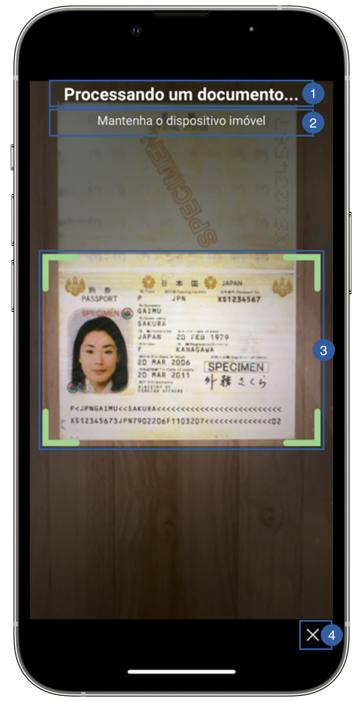

# Scan View

The second view of the document reader flow is the scan view, it's the camera screen that detects the document and reads it's data through OCR method.
This screen belongs to the document scan provider, so only the customization that provider exposes is possible.

{: style="height:600px;width:300px;display: block; margin: 0 auto"}

It contains a title(1), a message(2), a frame(3) and a cancel button (4) that can be customized.

## Branding

You can apply your own branding to our screens by overriding the resources we use.


### Colors
=== "Android"

    This is not customizable in Android yet

=== "iOS"

    The SDK's `Theme` does not apply to this screen, because the scan provider draws it.

    With the **AMADocScanMrziOS** provider, set the colors on its `ScannerTheme` before starting the scan. Any property left `nil` keeps the provider's default:

    ``` swift
    import AMADocScanMrziOS

    // Frame
    ScannerTheme.shared.colors.frameDefault
    ScannerTheme.shared.colors.frameSuccess
    ScannerTheme.shared.colors.frameError
    // Screen, overlay and instructions
    ScannerTheme.shared.colors.background
    ScannerTheme.shared.colors.overlayColor
    ScannerTheme.shared.colors.overlayOpacity
    ScannerTheme.shared.colors.instructionText
    ScannerTheme.shared.colors.tooltipText
    ScannerTheme.shared.colors.tooltipBackground
    ScannerTheme.shared.colors.tooltipBackgroundOpacity
    // Navigation bar and buttons
    ScannerTheme.shared.colors.navigationTitle
    ScannerTheme.shared.colors.navigationCloseButton
    ScannerTheme.shared.colors.navigationBackground
    ScannerTheme.shared.colors.primaryButtonBackground
    ScannerTheme.shared.colors.helpButtonText
    ScannerTheme.shared.colors.helpButtonBackground
    ```

    With the **AMADocScanRegulaiOS** provider, use that provider's own `Theme`:

    ``` swift
    import AMADocScanRegulaiOS

    // Default state
    AMADocScanRegulaiOS.Theme.shared.colors.cameraFrameDefaultColor
    // Valid state
    AMADocScanRegulaiOS.Theme.shared.colors.cameraFrameActiveColor
    ```

### Styles
=== "Android"

    This is not customizable in Android yet

=== "iOS"

    With the **AMADocScanMrziOS** provider, set the fonts on its `ScannerTheme`. Any property left `nil` keeps the provider's default:
    
    ``` swift
    ScannerTheme.shared.fonts.navigationTitle
    ScannerTheme.shared.fonts.instructionText
    ScannerTheme.shared.fonts.tooltipText
    ScannerTheme.shared.fonts.tipsTitle
    ScannerTheme.shared.fonts.tipsMessage
    ```
