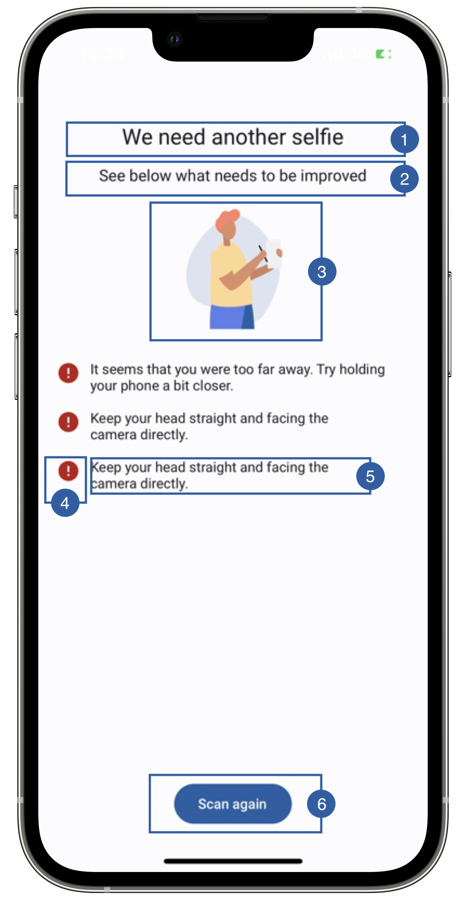

# Error View

When the showErrors flag is set to true in the BiometricFaceCaptureParameters class, then any error that happens in this feature will show a default screen with some information.
When the resulting image fails any of the quality tests, then this screen will also appear showing a list of the tests that failed.
You can either customize this screen to your branding or set the flag to false and handle the error in your own activity.


{: style="height:600px;width:300px;display: block; margin: 0 auto"}

It contains a title(1), a message(2), an image(3), a warning icon(4), a list item layout(5), a retry button(6) and a background that can be customized. 

## Branding

You can apply your own branding to our screens by overriding the resources we use.

### Text resources

=== "Android"

    You can add your own texts and localization by overriding the following string resources:
    ```xml

    <!-- Failed Tests Description -->
    <string name="face_capture_failed_tests_title_sdk_enrolment">We need another selfie</string>
    <string name="face_capture_failed_tests_subtitle_sdk_enrolment">See below what needs to be improved</string>
    <string name="not_eyes_closed_test_desc_sdk_enrolment">Make sure to keep a neutral expression: eyes open, mouth closed.</string>
    <string name="angle_test_desc_sdk_enrolment">Keep your head straight and facing the camera directly.</string>
    <string name="relative_eyeline_frame_test_desc_sdk_enrolment">Make sure your face is centered and fully visible within the frame</string>
    <string name="face_too_far_test_desc_sdk_enrolment">It seems that you were too far away. Try holding your phone a bit closer.</string>
    <string name="face_too_close_test_desc_sdk_enrolment">It seems that you were too close to the camera. Try holding your phone farther away.</string>
    <string name="multiple_face_test_desc_sdk_enrolment">Only the document owner should be in the frame.</string>
    <string name="image_blurred_test_desc_sdk_enrolment">The picture was not clear enough.</string>
    <string name="face_capture_liveness_check_test_sdk_enrolment">This seems to be a picture of a picture. It must really be a real-time selfie.</string>

    <!-- Face Capture Errors -->
    <string name="feature_failure_title_sdk_enrolment">There\'s something wrong</string>
    <string name="feature_failure_subtitle_sdk_enrolment">Check the items below:</string>
    <string name="error_face_capture_error_transaction_failed_sdk_enrolment">Biometric FaceCapture transaction service failed</string>
    <string name="error_face_capture_error_parameters_not_initialized_sdk_enrolment">Biometric FaceCapture parameters not initialized</string>
    <string name="error_face_capture_error_camera_setup_sdk_enrolment">Camera setup failed</string>
    <string name="error_face_capture_error_process_tests_sdk_enrolment">Biometric Face Capture quality tests failed</string>
    <string name="error_face_capture_error_liveness_test_sdk_enrolment">Liveness quality tests failed</string>
    <string name="error_face_capture_error_camera_permission_sdk_enrolment">Camera permission denied by user</string>
    <string name="error_face_capture_error_picture_not_found_sdk_enrolment">Face Capture picture not found</string>
    <string name="error_face_capture_error_picture_path_is_null_sdk_enrolment">Face Capture picture path is null</string>
    <string name="error_face_capture_error_report_is_null_sdk_enrolment">Face Capture process report is null</string>
    <string name="error_face_capture_error_terms_and_conditions_rejected_sdk_enrolment">Face Capture user rejected terms and conditions</string>
    <string name="error_face_capture_error_liveness_service_failed_sdk_enrolment">Face capture liveness service failed</string>
    <string name="error_face_capture_error_feature_permission_not_granted_sdk_enrolment">Face capture permission not granted</string>
    <string name="error_face_capture_error_generic_error_sdk_enrolment">Unknown error</string>
    ```

=== "iOS"

    The best way to override strings is by adding your key through the Theme class for the title and subtitle
    ``` swift
    Theme.shared.strings.faceCapture.titleQualityTests.localized()
    Theme.shared.strings.faceCapture.subtitleQualityTests.localized()
    ```
        
    The best way to override strings is by adding your key through the Theme class for the button
    ``` swift
    Theme.shared.strings.buttons.retake.localized()
    ```

### Colors
=== "Android"

    You can change the text colors by overriding the following color resource (It affects all texts):
    ```xml
    <color name="colorOverlayInvalidTxtSdkEnrolment">#1A1C1E</color>
    ```

    You can change the background color by overriding the following color resource:
    ```xml
    <color name="colorOverlayInvalidBgSdkEnrolment">#F1F0F4</color>
    ```

=== "iOS"

    You can change the color of the labels
    ``` swift
    Theme.shared.colors.faceCapture.titleDark
    ```
    
    You can change the color of the button (this affects all primary style buttons)
    ``` swift
    Theme.shared.colors.button.primaryBackground
    Theme.shared.colors.button.primaryTitle
    ```
    
### Styles
=== "Android"

    You can extend the styles we use and override any properties (textColor, textSize, fontFamily, etc...) you want.
    ```xml
    <style name="Theme.Sdk.Enrolment.TextView.Dark.Title.Centered">
    <style name="Theme.Sdk.Enrolment.TextView.Dark.Subtitle.Centered">
    ```
    Note: It will affect every component that uses the same style.

=== "iOS"

    You can change the font through the theme class (this will affect all text in the app):

    ``` swift
    Theme.shared.fonts.bold
    Theme.shared.fonts.regular
    ```

### Image

=== "Android"

    You can change the loading image by adding a drawable with this name:
    ```xml
    ic_face_capture_failed_sdk_enrolment.xml
    ```
    The image we are using is 120x120dp.

=== "iOS"

    You can change the image by adding a asset file and overriding the following image name in Theme class
    ``` swift
    Theme.shared.images.faceCapture.errorRedCircle
    Theme.shared.images.faceCapture.improveSelfie
    ```
