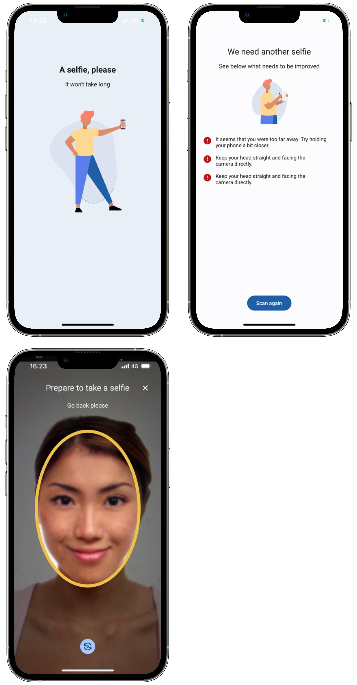

# Face Capture

The Mobile ID SDK provides a functionality that simplifies the process of obtaining a frame for
biometry checks. To achieve it, we use face detection technology, and capture a frame with the
user’s face. The live photo is then processed and checked against a liveness algorithm that will try
to detect specific characteristics of spoofing attempts, returning a score that indicates if the
person using the app is there or trying to impersonate someone else.

## Initiate Face Capture

The Mobile ID SDK provides a complete set of functionalities that allows capturing and processing
the user’s facial characteristics, and match them against the travel document’s photo. This helps
ensuring that the user who is enrolling is the document’s owner. The biometric face capture should
be the final step before creating a Digital ID in a remote system. If you only need to capture a
frame with the user’s face for biometric quality validation and check against liveness algorithms,
you can use the method biometricFaceCapture.

=== "Android"

    ```kotlin
    /**
     * Uses the device camera to capture a photo of the user face (selfie).
     *
     * Some tests will be run against this photo to ensure the photo quality and a liveness check verification.
     *
     * @param context Context
     * @param params [BiometricFaceCaptureParameters] configurations parameters.
     * @param resultLauncher [ActivityResultLauncher<Intent>] fragment or activity that will handle the results.
     */
    fun biometricFaceCapture(
        context: Context,
        params: BiometricFaceCaptureParameters,
        resultLauncher: ActivityResultLauncher<Intent>
    )
    ```

=== "iOS"

    ```swift
    /// Uses the device camera to capture a photo of the user face (selfie). Some tests will be run against this photo to ensure the photo quality and a liveness check verification.
    /// - Parameters:
    ///   - parameters: Configures the check liveness step.
    ///   - viewController: View controller that will present the face capture views.
    ///   - completionHandler: The completion handler to call when the face capture feature is finished.
    ///     This completion handler takes the following parameter:
    ///
    ///     Result<BiometricFaceCaptureReport, BiometricFaceCaptureError>
    ///     Where `BiometricFaceCaptureReport` contains  the results of the face capture
    ///     operation and `FaceCaptureReportError` the possible errors that may occur during the process.
        func biometricFaceCapture(parameters: BiometricFaceCaptureParameters, viewController: UIViewController, completionHandler: @escaping (Result<BiometricFaceCaptureReport, FaceCaptureReportError>) -> Void)
    ```

The SDK provides UI solutions for the capture process and photo preview, as shown in the images
below. The use of the photo preview depends on the BiometricFaceCaptureParameters passed to the
biometricFaceCapture method. Below is an example of that object:

=== "Android"

    ```kotlin
    @Parcelize
    data class BiometricFaceCaptureParameters(
        val showPreview: Boolean,
        val showErrors Boolean,
        val frameFormat: FaceCaptureFrameFormat = FaceCaptureFrameFormat.OVAL
    ) : Parcelable
    ```

    The **FaceCaptureFrameFormat** is an enum that shapes the frame where the face must be centered to take the selfie. Currently it has two options:
    
    ```kotlin
    enum class FaceCaptureFrameFormat {
        SQUARE,
        OVAL
    }
    ```
=== "iOS"

    ```swift
    public struct BiometricFaceCaptureParameters {
        public let showPreview: Bool
        public let frameShape: BiometricFaceCaptureFrameOptions
        public let showErrors: Bool
        public let cameraConfig: CameraConfig
        public let faceCaptureTimeout: TimeInterval?
        
        public init(showPreview: Bool,
                frameShape:BiometricFaceCaptureFrameOptions = .oval,
                showErrors: Bool,
                cameraConfig: CameraConfig = CameraConfig(),
                faceCaptureTimeout: TimeInterval? = nil)
    ```

    The **BiometricFaceCaptureFrameOptions** is an enum that shapes the frame where the face must be centered to take the selfie. Currently it has two options:
    
    ```swift
    public enum BiometricFaceCaptureFrameOptions {
        case oval
        case square
    }
    ```
    
    The **CameraConfig** is an enum that struct the frame where the face must be centered to take the selfie. Currently it has two options:
    
    ```swift
    public struct CameraConfig {
        public let toggleCameraEnable: Bool
        public let defaultCamera: AVCaptureDevice.Position
    
        public init(toggleCameraEnable: Bool = true,
                defaultCamera:AVCaptureDevice.Position = .front) {
            self.toggleCameraEnable = toggleCameraEnable
            self.defaultCamera = defaultCamera
        }
    }
    ```

The **showPreview** parameter is a boolean that when set to true will show the user’s picture after
taking it. You can also apply your app’s colors and fonts to these
layout solutions, to keep your brand’s image consistent. See Custom styles.

This function is used to acquire a high-resolution selfie with a 9:7 aspect ratio. The photo will
only be taken if the frame conforms to specific parameters that make sure the face is centered and
not too far away, or too close.

## Handle Result

=== "Android"

    Here's how you can get the result by using the result launcher that's passed as the final parameter:
    ```kotlin
    private val faceCaptureResultLauncher = registerForActivityResult(FaceCaptureResultLauncher())
    { result: FaceCaptureActivityResult ->
        when {
            result.success -> onSuccess(result.faceCaptureReportSuccess)
            result.faceCaptureReportError?.userCanceled == true -> onUserCanceled()
            result.faceCaptureReportError?.termsAndConditionsAccepted == false -> onUserTermsAndConditionsRejected()
            result.faceCaptureReportError?.failedTests != null && result.faceCaptureReportError?.performedTests != null ->
                onFailedTests(
                    result.faceCaptureReportError!!.performedTests!!,
                    result.faceCaptureReportError!!.failedTests!!
                )
            else -> onBiometricFaceCaptureError()
        }
    }
    ```

=== "iOS"

    ```swift
    enrolment?.biometricFaceCapture(parameters: params, viewController: view) { result in
        switch result {
        case .success(let report):
            print("Face capture successful.")
            EnrolmentData.faceCapture = report.photo
            EnrolmentData.biometricFaceCaptureReport = report
            completion(.success(()))
                
        case .failure(let biometricFaceCaptureError):
            EnrolmentData.biometricFaceCaptureReport = nil
                
            if biometricFaceCaptureError.userCanceled {
                print("Face capture cancelled by user.")
                completion(.failure(biometricFaceCaptureError))
            } else {
                print(biometricFaceCaptureError.featureError.publicMessage)
                completion(.failure(biometricFaceCaptureError))
            }
        }
    }
    ```

You will receive a model of the type FaceCaptureActivityResult that will contain the success data (in this case a FaceCaptureReportSuccess) or the error data.

=== "Android"

    ```kotlin
    data class FaceCaptureActivityResult(
        val faceCaptureReportSuccess: FaceCaptureReportSuccess?,
        val faceCaptureReportError: FaceCaptureReportError?
    ) {
        val success get() = faceCaptureReportSuccess != null
    }
    ```

=== "iOS"

    ```swift
    public struct BiometricFaceCaptureReport: Codable {
    
        /// Contains the list of biometric process tests performed in Orchestra during the biometric face capture process.
        public var performedTests: [CheckLivenessTest]
    
        /// Contains the list of biometric process tests failed in Orchestra during the biometric face capture process.
        public var failedTests: [CheckLivenessTest]
    
        /// Flag indicating if liveness check was performed or not during the biometric face capture process.
        public var performedLivenessCheck: Bool
        
        /// Biometric photo hash
        public var biometricHash: String?
        
        /// Biometric photo
        public var photo: UIImage? 
        
        public init(photo: UIImage, performedTests: [CheckLivenessTest], failedTests: [String], performedLivenessCheck: Bool, biometricHash: String?)
    }
    ```

The FaceCaptureReportError has the following structure:

=== "Android"

    ```kotlin
    data class FaceCaptureReportError(
        val userCanceled: Boolean,
        val termsAndConditionsAccepted: Boolean,
        val featureError: FeatureError?,
        val failedTests: List<String>?,
        val performedTests: List<String>?
    )
    ```

=== "iOS"

    ```swift
    public class FaceCaptureReportError: Error {
        public var userCanceled: Bool
        public var termsAndConditionsAccepted: Bool
        public var featureError: FeatureError
        public var failedTests: [String]?
        public var performedTests: [String]?
    }
    ```

The `FaceCaptureReportSuccess` includes a `biometricHash` attribute that needs to be included in the [Match](../BiometricMatch/BiometricMatch_Index.md) operation to verify data integrity. It also used when building a [Subject](../SubjectManagement/SubjectManagement_Index.md).

The failed tests might include one or more of the following tests:

| Name                         | Description                                                                                                                                                            |
|:-----------------------------|:-----------------------------------------------------------------------------------------------------------------------------------------------------------------------|
| FaceTooFarTest               | Error indicating that the face was very far.                                                                                                                           |
| FaceTooCloseTest             | Error indicating that the face was very close.                                                                                                                         |
| FaceNotCenteredTest          | Error indicating that the face was not centered.                                                                                                                       |
| MultipleFacesDetectedTest    | Error indicating that multiple faces were detected in the image.                                                                                                       |
| FaceRotatedTest              | Error indicating that the face was rotated in Z angle. A face with a positive Euler Z angle is rotated counter-clockwise relative to the camera.                       |
| NoFaceDetectedTest           | Error indicating that no face was detected in the picture.                                                                                                             |
| EyesClosedTest               | Error indicating that the eyes are closed.                                                                                                                             |
| SmilingTest                  | Error indicating that the user was smiling.                                                                                                                            |
| FaceSidewaysTest             | Error indicating that the face was rotated in Y angle. A face with a positive Euler Y angle is looking to the right of the camera, or looking to the left if negative. |
| FaceVerticalTest             | Error indicating that the face was rotated in X angle. A face with a positive Euler X angle is facing upward.                                                          |
| MouthOpenTest                | Error indicating that the user has the mouth open.                                                                                                                     |
| ImageBlurredTest             | Error indicating that the image is blurred.                                                                                                                            |
| FaceCropFailedTest           | Error indicating that the face crop failed.                                                                                                                            |
| LivenessCheckQualityTest     | Error indicating that the liveness quality test failed.                                                                                                                |
| LivenessCheckProbabilityTest | Error indicating that the liveness probability test failed.                                                                                                            |

## BiometricFaceCaptureCustomViews
The SDK provides default UI solutions for the document reader feature flow, as shown in the following images:

{: style="height:600px;width:300px;display: block; margin: 0 auto"}

The use of the preview layout depends on the showPreview flag in the BiometricFaceCaptureParameters.

The use of the Errors layout depends on the showErrors flag in the BiometricFaceCaptureParameters.

=== "Android"

    ```kotlin
    @Parcelize
    class BiometricFaceCaptureCustomViews(
        val loadingView: Class<out ICustomBiometricFaceCapture.LoadingView>? = null
    ) : Parcelable
    ```


=== "iOS"

    ```swift
    public class EnrolmentViewRegister {
        ...
        
        public func registerBiometricFaceCaptureLoadingView(_ viewType: FaceCaptureLoadingViewType)
        ...
    }
    ```

You can use your own custom views in the biometric face capture functionality. Your view must
implement the SDK view interfaces. For example, if you want to add a custom loadingView, your view
class must implement the ICustomBiometricFaceCapture.LoadingView interface.

In the customization tab you will also find examples to create your own custom views.
