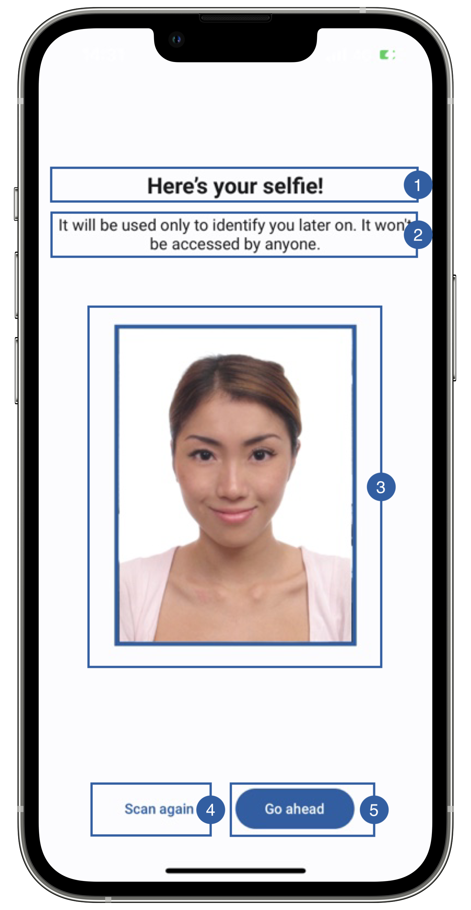

# Preview View

When the showPreview flag is set to true in the BiometricFaceCaptureParameters class, then at the end of the flow, a preview screen will be shown so that the user can check its selfie.
You can either customize this screen to your branding or set the flag to false and handle the preview in your own activity.

{: style="height:600px;width:300px;display: block; margin: 0 auto"}

It contains a title(1), a message(2), a frame (3), a retry button (4), a continue button(5) and a background that can be customized. 

## Branding

You can apply your own branding to our screens by overriding the resources we use.

### Text resources

=== "Android"

    You can add your own texts and localization by overriding the following string resources:
    ```xml
    <string name="biometric_face_capture_preview_title_sdk_enrolment">Here’s your selfie!</string>
    <string name="biometric_face_capture_preview_subtitle_sdk_enrolment">It will be used only to identify you later on. It won\'t be accessed by anyone.</string>
    <string name="bt_retake_sdk_enrolment">New selfie</string>
    <string name="bt_continue_sdk_enrolment">Go ahead</string>
    ```

=== "iOS"

    The best way to override strings is by adding your key through the Theme class
    
    ``` swift
    Theme.shared.strings.faceCapture.titlePreview.localized()
    Theme.shared.strings.faceCapture.subtitlePreview.localized()
    
    Theme.shared.strings.buttons.retake.localized()
    Theme.shared.strings.buttons.continue.localized()
    ```

### Colors
=== "Android"

    You can change the text colors by overriding the following color resource (It affects all texts):
    ```xml
    <color name="colorFaceCaptureTxtDarkSdkEnrolment">#1A1C1E</color>
    ```

    You can change the background color by overriding the following color resource:
    ```xml
    <color name="colorPreviewBgSdkEnrolment">#FDFCFF</color>
    ```

    ```xml
    <!-- Continue button -->
    <color name="colorButtonBlueTextSdkEnrolment">@android:color/white</color>
    <color name="colorButtonBlueBackgroundTintSdkEnrolment">#1F5FA6</color>

    <!-- Retake button -->
    <color name="colorButtonTransparentTextSdkEnrolment">#1F5FA6</color>
    <color name="colorButtonTransparentBackgroundTintSdkEnrolment">@android:color/transparent</color>
    ```

=== "iOS"

    You can change the text colors by overriding the following color in Theme class
    ``` swift
    Theme.shared.colors.faceCapture.titleDark
    ```
    
    You can change the background color by overriding the following color in Theme class:
    ``` swift
    Theme.shared.colors.faceCapture.background
    ```
    
    You can change the frame(3) color by overriding the following color in Theme class: (this affects all primary style buttons)
    ``` swift
    Theme.shared.colors.button.primaryBackground
    ```
    
    You can change the color of the retry button(4) (this affects all secondary style buttons)
    ``` swift
    Theme.shared.colors.button.secondaryBackground
    Theme.shared.colors.button.secondaryTitle
    ```
    
    You can change the color of the continue button(5) (this affects all primary style buttons)
    ``` swift
    Theme.shared.colors.button.primaryBackground
    Theme.shared.colors.button.primaryTitle
    ```
    
### Styles
=== "Android"

    You can extend the styles we use and override any properties (textColor, textSize, fontFamily, etc...) you want.
    ```xml
    <style name="Theme.Sdk.Enrolment.TextView.Dark.Title.Centered">
    <style name="Theme.Sdk.Enrolment.TextView.Dark.Subtitle.Centered">
    ```
    Note: It will affect every component that uses the same style.

=== "iOS"

    You can change the font through the theme class (this will affect all text in the app):
    
    ``` swift
    Theme.shared.fonts.bold
    Theme.shared.fonts.regular
    ```

### Image

=== "Android"

    You can change the frame around the selfie by adding a drawable with this name:
    ```xml
    bg_face_capture_preview_image.xml
    ```

=== "iOS"

    Does not apply to iOS
