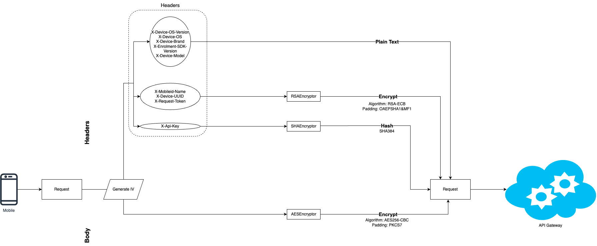
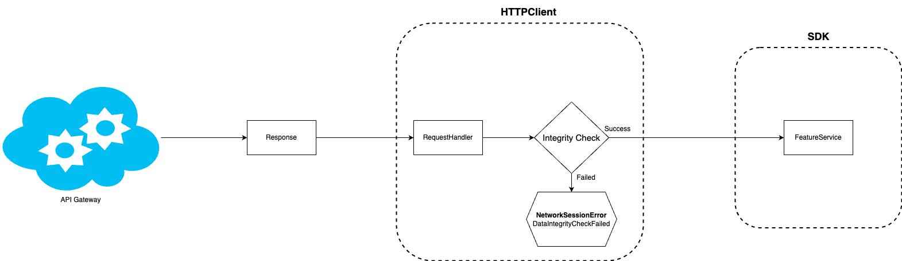
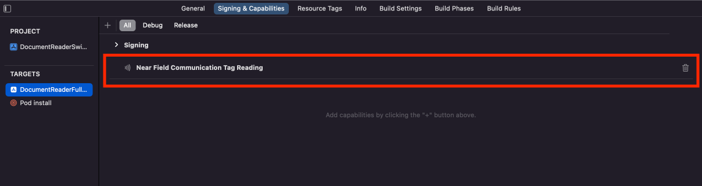
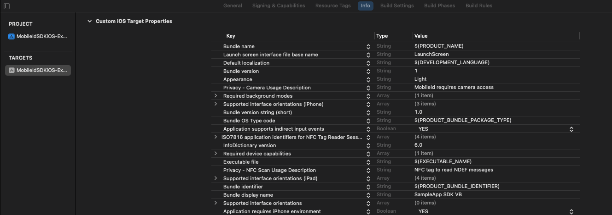

---
hide:
  - navigation
---
# Getting started

## Prerequisites

=== "Android"

    To integrate the Mobile ID SDK for Android, the following prerequisites must be met:

    - Install or update Android Studio to latest version;
    - Target API level 24 (Marshmallow) or later;
    - Use AndroidX, which requires minimum compileSdkVersion 30 or later.
    - Your app needs to have Firebase configured and initialized. For more information, see [https://firebase.google.com/docs/android/setup](https://firebase.google.com/docs/android/setup){target=_blank}.

=== "iOS"

    To integrate the **Mobile ID SDK** for iOS, the following prerequisites must be met: 
    
    - Install or update Xcode to latest version;
    - Target iOS 12 or later.

## Enrolment SDK setup

=== "Android"

    To add the Enrolment SDK to your app, perform the following steps:

    1. Add these new repositories in your app top level gradle file:
    ```
    maven { url "https://vbmobileidstorage.blob.core.windows.net/android/" }
    maven { url "http://maven.regulaforensics.com/RegulaDocumentReader" }
    ```
    2. Declare Mobile ID SDK as a dependency in your app level gradle file:
    ```
    implementation("com.visionbox.mobileid.sdk:mid-sdk-enrolment:<x.x.x>@aar") { transitive = true }   
    ```
    3. Sync gradle.
    
    **NOTE:** If you are not using Coroutines, you must also also declare these libraries in gradle dependencies:
    ```
    implementation "org.jetbrains.kotlinx:kotlinx-coroutines-core:1.6.1"
    implementation "org.jetbrains.kotlinx:kotlinx-coroutines-android:1.6.1"
    ```

=== "iOS"

    To add the Enrolment SDK to your app, perform the following steps:
    
    To always use the latest release, add the following to your Podfile:
    
    1. Add the following to your Podfile, with the latest version:
    ```
    pod 'MobileIdSDKiOS', '5.1.XX'
    ```
    2. Add Mobile ID’s cocoapods repo as a source in your podfile:
    ```
    source ‘https://cdn.cocoapods.org/
    ```
    3. Run in Terminal the command below to install pods in your project:
    ```
    pod install
    ```

    **NOTE:** Due the necessity of the SDK to be built for distribution, a post installscript might be needed in your Podfile: (https://github.com/CocoaPods/CocoaPods/issues/9232).
    Example:
    ```
    post_install do |installer|
        installer.pods_project.build_configurations.each do |config|
            config.build_settings['BUILD_LIBRARY_FOR_DISTRIBUTION'] = 'YES'
            config.build_settings["EXCLUDED_ARCHS[sdk=iphonesimulator*]"] = "arm64"
        end
    end
    ```

## How to initialize the SDK

The Enrolment provides access to all the SDK features in a simple way. The app needs to create an instance of the Enrolment interface. We recommend treating this instance as Singleton.
    
You can also specify the configurations that will be needed depending on the SDK functionalities you intend to use on your app. 

By using the available EnrolmentBuilder, you can instantiate the enrolment like this:

=== "Android"

    ```kotlin
    val apiConfig = APIConfig(
        baseUrl = URL("YOUR BASE URL"),
        timeout = 30, // timeout in seconds
        logLevel = MobileAPILogLevel.BASIC,
        apiKey = "YOUR KEY",
        publicKey = "YOUR PUBLIC KEY", // Optional parameter to ensure requests are encrypted
    )

    val enrolmentConfig = EnrolmentConfig(apiConfig)

    val enrolment = EnrolmentBuilder
        .of(context, enrolmentConfig)
        .build() // The Enrolment should be a singleton
    ```
    The following parameters must always be provided:

    - Context - Application context;
    - EnrolmentConfig - Enrolment configuration.

=== "iOS"

    ```swift
    private let enrolmentConfig = EnrolmentConfig( apiConfig: APIConfig(
            baseURL: "YOUR BASE URL",
            timeout: 30, // timeout in seconds
            logLevel: .basic,
            apiKey: "YOUR KEY"
            publicKey = "YOUR PUBLIC KEY" // Optional parameter to ensure requests are encrypted
    ))

    let enrolment = EnrolmentBuilder
        .of(enrolmentConfig: enrolmentConfig)
        .build() // The Enrolment should be a singleton
    ```

    The following parameters must always be provided:
    
    - EnrolmentConfig - Enrolment configuration.

The SDK also allows client apps to use their own custom views for its functionalities. These custom views must be defined when creating the Enrolment instance. For more information on custom view, please check the [advanced configurations](#advanced-configurations) section.

## Data Security

In version 7.1, an hybrid encryption system was implemented to protect sensitive information and to prevent possible attacks.

{: style="display: block; margin: 5px auto"}

The requests that are sent from the mobile platforms (both iOS and Android) now encrypt the headers that contain sensitive information, and the api key is hashed to prevent it from being leaked.

The algorithm used to encrypt the headers is RSA-ECB with a secure padding algorithm. 
This cypher mechanism uses a public key to encrypt it and a private key that is only known by the Backend so that they are able to decrypt the headers and verify the data.

**It is possible to pass a public key as a string in the APIConfig, but you need to pass us the matching private key so that it's uploaded into the backoffice, otherwise the default keys will be used.**

The API key now also validates if the application that is making the request is known by checking it's ID. 
This prevents unauthorized access by using leaked API keys.
You need to give us the application IDs that should be allowed to use your API key.

In matters of user sensitive information (eg: biometric face capture image), the body of every HTTP request is now encrypted by using AES and a secure padding with a dynamically generated IV.
This aims to prevent leaked information by the use of proxy's or interceptors.

There's also a data integrity validation system that checks if the response information was not tampered with by comparing the body's hashed value with one of the headers.

{: style="display: block; margin: 5px auto"}

## Configurations

### EnrolmentConfig

The EnrolmentConfig is where you set the apiConfig and the apiSecurityConfig. Besides these
configurations you can set the logEvents flag, which is used to activate logs.

=== "Android"

    ```kotlin
    data class EnrolmentConfig(
        val apiConfig: APIConfig,
        val apiSecurityConfig: APISecurityConfig = APISecurityConfig(),
        val language: Locale
    ) : Parcelable
    ```
    
=== "iOS"

    ```swift
    private let enrolmentConfig = EnrolmentConfig(
        apiConfig: apiConfig ,
        apiSecurityConfig, apiSecurityConfig
        language: language
    )
    ```

- apiConfig: Api configuration;
- apiSecurityConfig: Api security configuration;
- language: You can set the language in which the SDK will appear. The default is the system
  language;

### ApiConfig

You always need to specify the baseUrl for your Mobile ID API instance, as well as your provided API
key. You can also configure the timeout value for server responses and the log level.

=== "Android"

    ```kotlin
    /**
     * Mobile API server config.
     *
     * @param baseUrl url from Mobile API server.
     * @param timeout timeout of a request.
     * @param logLevel log level for requests (e.g. Body, Headers).
     * @param apiKey key to authorize communication with Mobile API.
     * @param publicKey key to use for ciphering/deciphering for secure communications
     */
    data class APIConfig(
        val baseUrl: URL,
        val timeout: Long,
        val logLevel: MobileAPILogLevel,
        val apiKey: String,
        val publicKey: String? = null,
    )
    ```

=== "iOS"

    ```swift
    APIConfig(
        baseURL: "YOUR BASE URL",
        timeout: 30, 
        logLevel:  .basic, 
        apiKey: "YOUR KEY" ,
        publicKey: String? = nil  
    )
    ```

- baseUrl: Url from Mobile API server;
- timeout: timeout of a request in seconds;
- logLevel: log level for requests;
- apiKey: key to authorize communication with Mobile API;
- publicKey: key to use for ciphering/deciphering for secure communications

=== "Android"

    ```kotlin
    enum class MobileAPILogLevel {
        /**
        * no logs.
        */
        NONE,

        /**
        * logs request and response lines.
        */
        BASIC
    }
    ```

=== "iOS"

    ```swift
    public enum APILogLevel {
        /// No logs.
        case none
        /// Logs http status code and name of endpoint.
        case basic
    }
    ```

### APISecurityConfig

You can use the security config to specify a list of SSL certificates to be trusted when connecting
the SDK to a server instance. By providing this configuration, you are activating certificate
pinning for every network request made by the SDK.

=== "Android"

    ```kotlin
    @Parcelize
    data class APISecurityConfig(
        val certificates: List<X509Certificate> = listOf()
    ) : Parcelable
    ```
    
=== "iOS"

    ```swift
    struct APISecurityConfig {
        /// Certificates to verify against Certificate Pinning
        let sslCertificates: [SecCertificate]
        init(sslCertificates: [SecCertificate]) {
            self.sslCertificates = sslCertificates
        }
    }
    ```

- certificates: used for certificate pinning

## Advanced Configurations

=== "Android"

    The other configurations are used by their corresponding facade method:

    - DocumentReaderConfig - Multipage processing and Regula database ID;
    - BoardingPassCustomViews - Specifies the boarding pass custom views;
    - BiometricFaceCaptureCustomViews - Specifies the face capture custom views;
    - DocumentReaderCustomViews - Specifies the document reader custom views.
    - BiometricFaceMatchCustomViews - Specifies the face match custom views.
    - SubjectCustomViews - Specifies the subject custom views.

    These custom views are instantiated in the sdk using reflection, so for this reason, pro-guard might obfuscate some constructors. It's important to use pro-guard rules on the custom views that you created to avoid issues on the building process.
    Check [here](https://developer.android.com/studio/build/shrink-code#keep-code) for more details on how to create rules to keep the class.

    The following sections show some examples of the mentioned configurations.

    ```kotlin
    val builder: EnrolmentBuilder = EnrolmentBuilder
        .of(context, config)
        .withDocumentReaderConfig(
            DocumentReaderConfig(
                multipageProcessing = true,
                databaseId = "DatabaseName"
            )
        )
        .withDocumentReaderCustomViews(
            DocumentReaderCustomViews(
                loadingView = DocumentReaderCustomViewLoading::class.java,
                rfidInstructionsView = DocumentReaderCustomViewRfidInstructions::class.java,
                rfidSearchView = DocumentReaderCustomViewRfidSearch::class.java,
                rfidProcessView = DocumentReaderCustomViewRfidProcess::class.java,
            )
        )
        .withBiometricFaceCaptureCustomViews(
            BiometricFaceCaptureCustomViews(
                loadingView = BiometricFaceCaptureCustomViewLoading::class.java
            )
        )
        .withBoardingPassCustomViews(
            BoardingPassCustomViews(
                loadingView = BoardingPassCustomViewLoading::class.java
            )
        )
        .withBiometricFaceMatchCustomViews(
            BiometricFaceMatchCustomViews(
                loadingView = BiometricFaceMatchCustomViewLoading::class.java
            )
        )
        .withSubjectCustomViews(
            SubjectCustomViews(
                loadingView = SubjectCustomViewLoading::class.java
            )
        )

    return builder.build()
    ```
=== "iOS"

    You can now apply and implement your own UI solutions for the SDK  with the new feature of custom views for the Mobile ID SDK, giving you even more control with the UI solutions. To enable this feature in your application, you need to create your view and make it conform to the view protocol that you intend to replace in the SDK. Then, you register that view in the new EnrolmentViewRegister class of the SDK  and you build the enrolment instance with that viewRegister  instance. 

    The following code shows an example:
    ```swift
    let viewRegister = EnrolmentViewRegister()
    viewRegister.registerBiometricMatchErrorOverlayView(BiometricMatchErrorView.self)

    let enrolmentConfig = r.resolve(EnrolmentConfig.self)!
    let documentReaderConfig = r.resolve(DocumentReaderConfig.self)!
            
    let enrolment = EnrolmentBuilder.of(enrolmentConfig: enrolmentConfig)
            .with(documentReaderConfig: documentReaderConfig)
            .with(viewRegister: viewRegister)
            .build()
    ```
    
## RFID Chip Processing

=== "Android"

    In order to use the RFID feature, the user must give the NFC permission in runtime, otherwise it won't work. 
    We already handle the permission check and added to the manifest the following:

    ``` xml
    <uses-permission android:name="android.permission.NFC" />
    ```

    So when using the RFID feature, the user will be prompted to concede the permission if it hadn't already.

=== "iOS"

    Here you can find the necessary changes in order to read the RFID chip present in some documents:

    ### Permissions
    Add Near Field Communication Tag Reading under the Capabilities tab for the project’s target:
    {: style="display: block; margin: 5px auto"}
    Add the NFCReaderUsageDescription permission to your Info.plist file as its needed to access the NFC hardware:
    ``` html
    <key>NFCReaderUsageDescription</key>
    <string>NFC tag to read NDEF messages</string>
    ```
    Declare com.apple.developer.nfc.readersession.iso7816.select-identifiers a list of application identifiers that the app
    must be able to read according to ISO7816:
    ``` html
    <key>com.apple.developer.nfc.readersession.iso7816.select-identifiers</key>
    <array>
        <string>A0000002471001</string>
        <string>E80704007F00070302</string>
        <string>A000000167455349474E</string>
        <string>A0000002480100</string>
        <string>A0000002480200</string>
        <string>A0000002480300</string>
        <string>A00000045645444C2D3031</string>
    </array>
    ```

## Camera Permissions
In order for the SDK to use the camera, the user must grant permission to do so.

=== "Android"

    In order to use the camera related features, the user must give the camera permission in runtime, otherwise it won't work. 
    We already handle the permission check and added to the manifest the following:

    ``` xml
    <uses-permission android:name="android.permission.CAMERA" />
    ```

    So when using any feature that needs the camera, the user will be prompted to concede the permission if it hadn't already.

=== "iOS"

    To configure access alerts, follow the steps bellow.

    In the app's **Info.plist** file, include **NSCameraUsageDescription**.
    After including **NSCameraUsageDescription** in your **Info.plist** file, provide a message that explains the user why your app needs to capture media.
    {: style="display: block; margin: 5px auto"}

## Custom Styles

=== "Android"

    You can apply your app’s own colors and fonts to all the provided SDK layout solutions, which means that the SDK views can adapt to your app’s design. 
    It brings control and allows the maintenance of consistency in terms of brand communication when using the SDK custom views for data presentation. 

    The fonts we are using in the SDK are named enrolment_sdk_medium and enrolment_sdk_regular. If you use fonts with the same name in your app, they will be used, otherwise the SDK will use its own. 
    We do not advise to override strings. Our strings’ names in strings.xml end in _sdk_enrolment precisely to prevent any unexpected behaviors.

    The list of colors used in each screen will be available on their respective documentation for your reference.

=== "iOS"

    You can apply your app’s own styles to all the provided SDK  layout solutions, which means that the SDK  views can adapt to your app’s design. 
    It brings control and allows the maintenance of consistency in terms of brand communication when using the SDK  custom views for data presentation.

    The following image shows an example of how you could override SDK  values for fonts, colors and strings:
    ```swift
    enrolment.theme.fonts.medium = FontDescription(name: "FontName-Medium")
    enrolment.theme.colors.faceCapture.stateError = UIColor(name: .colorPrimary)
    enrolment.theme.strings.faceCapture.title = "Face Capture Title"
    ```

    Please contact vision-box®  if you wish to support a new language.

    Please check the complete list of colors for your reference:

    | Name                                   | Value                                      | Section            |
    |----------------------------------------|--------------------------------------------|--------------------|
    | common.clear                           | Clear_SdkEnrolment                         | Base               |
    | common.black                           | Black_SdkEnrolment                         | Base               |
    | component.dismissButton                | DismissButton_SdkEnrolment                 | Base               |
    | component.transparentOverlay           | TransparentOverlay_SdkEnrolment            | Base               |
    | component.animationIndicatorBackground | AnimationIndicationBackgroud_SdkEnrolment  | Base               |
    | component.animationIndicatorMessage    | AnimationIndicatorMessage_SdkEnrolment     | Base               |
    | datafield.title                        | DataFieldTitle_SdkEnrolment                | Base               |
    | datafield.value                        | DataFieldValue_SdkEnrolment                | Base               |
    | datafield.error                        | DataFieldError_SdkEnrolment                | Base               |
    | button.primaryTitle                    | ButtonPrimaryTitle_SdkEnrolment            | Button             |
    | button.primaryBackground               | ButtonPrimaryBackground_SdkEnrolment       | Button             |
    | button.secondaryTitle                  | ButtonSecondaryTitle_SdkEnrolment          | Button             |
    | button.secondaryBackground             | ButtonSecondaryBackground_SdkEnrolment     | Button             |
    | button.secondaryBorder                 | ButtonSecondaryBorder_SdkEnrolment         | Button             |
    | documentData.background                | DocumentDataBackground_SdkEnrolment        | Document read      |
    | documentData.title                     | DocumentDataTitleSdkEnrolment              | Document read      |
    | documentData.subtitle                  | DocumentDataSubtitle_SdkEnrolment          | Document read      |
    | documentData.detailBackground          | DocumentDataDetailBackground_SdkEnrolment  | Document read      |
    | rfidData.background                    | RfidDataBackground_SdkEnrolment            | Document read      |
    | rfidData.title                         | RfidDataTitle_SdkEnrolment                 | Document read      |
    | rfidData.subtitle                      | RfidDataSubtitle_SdkEnrolment              | Document read      |
    | faceCapture.background                 | FaceCaptureBackground_SdkEnrolment         | Face capture       |
    | faceCapture.title                      | FaceCaptureTitle_SdkEnrolment              | Face capture       |
    | faceCapture.flash                      | FaceCaptureFlash_SdkEnrolment              | Face capture       |
    | faceCapture.stateLabel                 | FaceCaptureStateLabel_SdkEnrolment         | Face capture       |
    | faceCapture.stateValid                 | FaceCaptureStateValid_SdkEnrolment         | Face capture       |
    | faceCapture.stateError                 | FaceCaptureStateError_SdkEnrolment         | Face capture       |
    | faceCapture.stateNeutral               | FaceCaptureStateNeutral_SdkEnrolment       | Face capture       |
    | boardingPassScan.background            | BoardingPassScanBackground_SdkEnrolment    | Boarding pass scan |
    | boardingPassPreview.background         | BoardingPassPreviewBackground_SdkEnrolment | Boarding pass scan |
    | boardingPassPreview.legHeader          | BoardingPassPreviewLegHeader_SdkEnrolment  | Boarding pass scan |

## Dependencies

=== "Android"

    - MLKit
        - com.google.mlkit:barcode-scanning:17.2.0
        - com.google.mlkit:face-detection:17.1.0
        - androidx.camera:camera-camera2:1.3.0
        - androidx.camera:camera-lifecycle:1.3.0
        - androidx.camera:camera-view:1.3.0

    - Regula
        - com.regula.documentreader:api:7.1.9667@aar
        - com.regula.documentreader.core:ocrandmrzrfid:7.1.10524@aar

    - Sentry
        - io.sentry:sentry-android:6.28.0

    - Lottie
        - com.airbnb.android:lottie:6.1.0
        
=== "iOS"

    - 'DocumentReader', '~> 6.8.0'
    - 'DocumentReaderOCRRFID', '~> 6.8.0'
    - 'Sentry', '7.16.0'
    - 'lottie-ios', '~> 3.4.0'

## Glossary and Terminology

The following descriptions include the terminology found within this manual:

| Name                                           | Description                                                                                                                                                                                                                                                                                                                                                                                                                                                                                                                                                                                                                                             |
|:-----------------------------------------------|:--------------------------------------------------------------------------------------------------------------------------------------------------------------------------------------------------------------------------------------------------------------------------------------------------------------------------------------------------------------------------------------------------------------------------------------------------------------------------------------------------------------------------------------------------------------------------------------------------------------------------------------------------------|
| API (Application Program Interface)            | An application program interface is a set of routines, protocols, and tools for building software applications. Basically, an API specifies how software components should interact.                                                                                                                                                                                                                                                                                                                                                                                                                                   |
| APIS (Advance Passenger Information System)    | An electronic data interchange system intended to enhance border security. An APIS collects and shares limited data on passengers and crew members, such as identification details from the passport and basic flight information. Passengers must provide this data before traveling to or from certain countries. Then the airlines or vessel operators share it with the computer system of the destination state.                                                                                                                                                                                          |
| BCBP (Bar-Coded Boarding Pass)                 | A standard issued by the International Air Transport Association (IATA) that defines the format and content of electronic boarding passes. BCBP defines the two-dimensional (2D) barcode and the symbologies used for paper and mobile boarding passes. Airlines, airports, and other air industry stakeholders use barcode readers to capture the data from the electronic boarding passes to process the security check and boarding of travelers.                                                                                                                                                                        |
| Certificate                                    | Electronic document establishing a digital identity by combining the identity name or identifier with the public key of the identity, a validity period, and an electronic signature by a third party.                                                                                                                                                                                                                                                                                                                                                                                                                                       |
| DK (Data Key)                                  | A key used to protect an entity, where in this instance an entity is biographic data related to a TD, a BCBP, biometric data or other entity relating to a natural person.                                                                                                                                                                                                                                                                                                                                                                                                                                                                   |
| IATA (International Air Transport Association) | A trade association representing airlines worldwide. IATA supports many areas of aviation activity and formulates industry policies on critical aviation issues. IATA works with other international bodies, such as ICAO and WCO.                                                                                                                                                                                                                                                                                                                                                                          |
| LED (Light Emitting Diode)                     | A two-lead semiconductor light source. LEDs provide many advantages when used for environmental lighting, such as smaller volume, longer lifetime, and lower energy requirements.                                                                                                                                                                                                                                                                                                                                                                                                                                               |
| Liveness                                       | Indication whether an acquired biometric sample comes from a genuine living passenger or not. The liveness detection is used to detect if a passenger is trying to spoof the system.                                                                                                                                                                                                                                                                                                                                                                                                                                                  |
| MRZ (Machine Readable Zone)                    | MRZ Machine Readable ZoneThe area of the travel document containing data in an optical character recognition format that allows the information to be read automatically by a machine, such as a passport reader.                                                                                                                                                                                                                                                                                                                                                                                                                                       |
| NFC (Near Field Communication)                 | NFC Near Field CommunicationA method of wireless data transfer that evolved from Radio-Frequency Identification (RFID) technology. This method detects and enables two electronic devices near establish communication without the need for an internet connection. Devices with an NFC chip (for example, smartphones) can detect a chip from another device and transfer data when both devices are held within 4 cm (2 in.) from each other.                                                                                                                                                                                                         |
| QR code (Quick Response Code)                  | A type of 2D barcode used to provide easy access to information through a smartphone. A QR code consists of black modules (square dots) arranged in a square grid on a white background, which can be read by an imaging device (such as a camera or scanner). The required data is extracted from the patterns that are present in both horizontal and vertical components of the image. The QR code system became widespread due to its fast readability and greater storage capacity compared to standard barcodes. It is commonly used in item identification, product tracking, time tracking, and document management. |
| RFID (Radio-Frequency Identification)          | A technology of wireless communication that uses radio waves to automatically identify and track objects. The objects contain tags that store electronic information. An RFID system enables readers to retrieve data from identification documents, such as smart cards. RFID devices work within a vicinity of between a few centimeters to several meters (up to 20 feet) for high-frequency devices.                                                                                                                                                                                                             |
| TD (Travel Document)                           | A passport or ID card in ICAO format authorised for border control.                                                                                                                                                                                                                                                                                                                                                                                                                                                                                                                                                                   |
| TLS/SSL                                        | TLS SSL Transport Layer Security (TLS) and its predecessor, Secure Sockets Layer (SSL), are cryptographic protocols designed to provide communications security over a computer network.                                                                                                                                                                                                                                                                                                                                                                                                                                                                 |
| User                                           | A person that uses the equipment under the supervision of trained staff.                                                                                                                                                                                                                                                                                                                                                                                                                                                                                                                                                                            |
| Workflow                                       | Orchestrated and repeatable pattern of processes, running in the touchpoints, which represents the desired behaviour of the cluster.                                                                                                                                                                                                                                                                                                                                                                                                                                                                                                            |
